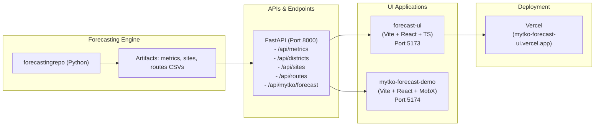

# Waste Forecasting System — Projects Map & Documentation Guide

This document maps all waste forecasting related projects, their purposes, documentation locations, and how they interconnect.

---

## 🎯 Quick Overview

| Project | Location | Purpose | Status |
|---------|----------|---------|--------|
| **forecastingrepo** | `/projects/forecastingrepo/` | Core forecasting engine (Python) | Active |
| **forecast-ui** | `/projects/forecast-ui/` | UI (Vite + React + TypeScript) | Active |
| **mytko-forecast-demo** | `/projects/mytko-forecast-demo/` | Demo app consuming API (Vite + React + MobX) | Active |

---

## 📊 Project Details & Architecture

### 1. **forecastingrepo** — Core Forecasting Engine
**Location**: `/projects/forecastingrepo/`

#### Purpose
- Python-based waste (ТКО) forecasting system
- Predicts fill percentages, overflow risk, and recommended routes
- Performs backtesting and accuracy metrics (WAPE, SMAPE, MAE)
- Serves forecast data via FastAPI REST API

#### Key Components

**Backend/Core Python**:
- `src/sites/` — Site-level baseline and simulation
  - `baseline.py` — Calculate weekday rates (S2)
  - `simulator.py` — Fill trajectory simulation (S2)
  - `reconcile.py` — Reconcile sites→district (S3)
  - `schema.py` — Data models + validators
- `scripts/ingest_and_forecast.py` — Phase-0 CLI, QA, region aggregation
- `scripts/api_app.py` — FastAPI endpoints (read-only; JSON+CSV)
- `scripts/backtest_eval.py` — District/region metrics (WAPE/SMAPE/MAE)
- `scripts/backtest_sites.py` — Site-level scorecards
- `scripts/routes_recommend.py` — Routing recommendations (S4, flagged)

**Configuration**:
- `scenarios/*.yml` — Feature flags and parameters (sites behind flag)
- `specs/overview/*.md` — Architecture docs

**Testing**:
- `tests/api/*.py` — API endpoint smoke tests
- `tests/backtest/*.py` — Metrics unit tests
- `tests/sites/`, `tests/routes/`, `tests/scripts/` — Additional coverage

**Artifacts** (generated):
- `reports/backtest_consolidated_auto/` — Gallery, histograms, consolidated CSV
- `reports/sites_demo/` — Demo sites & routes CSVs + QA

#### Documentation Index
All docs in `/projects/forecastingrepo/docs/System/`:

**Getting Started**:
- `Overview.md` — **START HERE**: handoff summary, live links, key metrics
- `Onboarding.md` — Full onboarding guide
- `Quicklook.md` — Quick overview of system
- `Demo_Runbook.md` — Step-by-step demo instructions

**Architecture & Design**:
- `Repo_Layout.md` — Directory structure
- `Repo_Map.md` — Code areas and review bundles
- `Monorepo_Plan.md` — Future monorepo structure (packages/core + apps/api + apps/ui)
- `Architecture_Forecast_Integration.md` — Integration architecture
- `VDD.md` (in `/docs/architecture/`) — Value-Driven Design docs

**API & Integration**:
- `API_Endpoints.md` — Frozen v0 endpoints (read-only)
- `Forecasting_UI.md` — UI surfaces and acceptance criteria
- `Health_Checks.md` — Health check procedures

**Operations**:
- `CI_CD.md` — CI/CD pipeline setup
- `Testing.md` — Test pyramid, BDD, E2E
- `Release.md` — Release procedures
- `Spec_Sync.md` — Specification synchronization

**Data**:
- `docs/data/DATA_CONTRACTS.md` — Data schemas
- `docs/data/SITE_DATA_CONTRACT.md` — Site-level data contract
- `docs/data/WEATHER_DATA_CONTRACT.md` — Weather data contract

**Tasks & PRs**:
- `docs/Tasks/` — Individual PR task docs (PR-14, PR-15, S1–S6, etc.)
- `docs/Tasks/NEXT_AGENT_BRIEF.md` — Agent handoff
- `docs/Tasks/COORDINATOR_REVIEW_CHECKLIST.md` — Review checklist

**Architecture Decisions (ADRs)**:
- `docs/adr/DECISIONS_INDEX.md` — All decisions
- `docs/adr/ADR-*.md` — Individual decisions (scenarios, baseline, metrics, backtesting, etc.)

#### Key Metrics & Acceptance
- **Accuracy (2024 windows)**:
  - Region WAPE median ≈ 8.13%
  - District WAPE median ≈ 13.11% (p75 20.06%, p90 33.96%)
  - Backtest gallery: `reports/backtest_consolidated_auto/index_en.html`

- **Tests**: ≥85% coverage, spec_sync and docs_check OK

#### Running Locally
```bash
cd /projects/forecastingrepo
# Local demo up (includes API on :8000)
scripts/dev/local_demo_up.sh

# Or manually:
python scripts/api_app.py  # API on http://127.0.0.1:8000
# Check: curl http://127.0.0.1:8000/api/metrics
```

---

### 2. **forecast-ui** — Main Forecasting UI
**Location**: `/projects/forecast-ui/`

#### Purpose
- **Lightweight React + TypeScript UI** for waste forecasting visualization
- Consumes data from `forecastingrepo` API
- Displays accuracy metrics, districts, sites, and routing recommendations
- Deployed on **Vercel**

#### Technology Stack
- **React 18** + TypeScript
- **Vite** — Fast bundler
- **Tailwind CSS** — Styling
- **Recharts** — Charts/graphs
- **Vercel** — Deployment platform

#### Project Structure
```
forecast-ui/
├── src/
│   ├── components/
│   │   ├── Layout.tsx          # Main layout with sidebar + tabs
│   │   ├── Sidebar.tsx         # Navigation sidebar
│   │   ├── Overview.tsx        # WAPE metrics view
│   │   ├── Districts.tsx       # Districts table + pie chart
│   │   ├── Sites.tsx           # Sites table with forecasts
│   │   └── Routes.tsx          # Route recommendations
│   ├── data/
│   │   └── metrics.ts          # Types and mock data
│   ├── App.tsx                 # Main app
│   ├── main.tsx                # Entry point
│   └── index.css               # Global styles + Tailwind
├── package.json
├── vite.config.ts
├── tailwind.config.js
├── tsconfig.json
└── vercel.json                 # Vercel deployment config
```

#### Key Views
1. **Overview** — WAPE accuracy by region + districts
2. **Districts** — Best/worst districts by SMAPE
3. **Sites** — Container site forecasts with risk filtering
4. **Routes** — Routing recommendations (strict vs. showcase policies)

#### Documentation
- `README.md` — **START HERE**: tech stack, setup, deployment
- `NEXT_AGENT_HANDOFF.md` — Agent handoff instructions
- `REVIEW_GUIDE.md` — Quick review checklist
- `REVIEW_CHECKLIST.md` — Smoke test & screenshot checklist
- `CHANGES.md` — What's new
- `HOWTO_E2E.md` — Playwright E2E test instructions
- `AFTER_DEMO_PLAN.md` — Post-demo improvements
- `docs/` — Additional docs

#### Running Locally
```bash
cd /projects/forecast-ui
npm install
npm run dev
# Opens on http://localhost:5173 (or specified port)
npm run preview  # Test production build locally
```

#### Deployment (Vercel)
```bash
# Option A: Via CLI
npm i -g vercel
vercel login
vercel
vercel --prod  # Production

# Option B: GitHub + Vercel Dashboard
# - Push to GitHub
# - Connect repo in vercel.com
# - Auto-deploys on push
```

#### Live Links
- **Vercel**: https://mytko-forecast-ui.vercel.app (optional)
- **Local**: http://127.0.0.1:4173 (via `local_demo_up.sh`)

---

### 3. **mytko-forecast-demo** — Alternative Demo App
**Location**: `/projects/mytko-forecast-demo/`

#### Purpose
- **Alternative UI** consuming `/api/mytko/forecast` endpoint
- Uses **Vite + React + MobX + Ant Design** (matches MyTKO stack)
- Lightweight, minimal demo implementation
- Separate from main `forecast-ui` project

#### Technology Stack
- **Vite** — Fast bundler
- **React** — UI library
- **MobX** — State management (matches MyTKO)
- **Ant Design** — Component library (matches MyTKO)

#### Documentation
- `README.md` — **START HERE**: setup, usage, env vars
- `AGENTS.md` — Agent-specific notes

#### Running Locally
```bash
cd /projects/mytko-forecast-demo
npm install
npm run dev -- --port 5174
# Opens on http://localhost:5174
```

#### Environment Variables
```bash
VITE_API_BASE=http://127.0.0.1:8000  # Override API origin
```

#### Data Source
- Consumes `/api/mytko/forecast` endpoint from `forecastingrepo`
- Follows `ForecastDataFormat` schema

#### Use Case
- Demonstrates MyTKO-compatible UI without needing the main forecasting UI
- Useful for testing with MyTKO's design patterns and tech stack

---

## 🔗 How They Connect



### Data Flow
1. **forecastingrepo** generates forecasts and metrics
2. **Scripts** produce artifacts (CSVs, JSON reports)
3. **FastAPI** (in forecastingrepo) serves those artifacts as JSON/CSV
4. **forecast-ui** (or mytko-forecast-demo) consumes the API
5. **Vercel** hosts the deployed UI

### Port Mapping (Local)
| Service | Port | URL |
|---------|------|-----|
| FastAPI (forecastingrepo) | 8000 | http://127.0.0.1:8000 |
| forecast-ui (Vite dev) | 5173 | http://127.0.0.1:5173 |
| mytko-forecast-demo (Vite dev) | 5174 | http://127.0.0.1:5174 |

### Environment Configuration
- **CORS**: Set `API_CORS_ORIGIN` in forecastingrepo to UI origin
- **API Base**: UI can override API URL via env var (e.g., `VITE_API_BASE`, `NEXT_PUBLIC_API_BASE`)
- **Demo Date**: Default from `VITE_DEMO_DEFAULT_DATE` (UI) or `/api/metrics` (fallback)

---

## 📚 Documentation Map

### Start Here
1. `/projects/forecastingrepo/docs/System/Overview.md` — System overview & key metrics
2. `/projects/forecastingrepo/docs/System/Onboarding.md` — Full onboarding
3. `/projects/forecast-ui/README.md` — UI setup & deployment

### Architecture
- `/projects/forecastingrepo/docs/System/Monorepo_Plan.md` — Future monorepo structure
- `/projects/forecastingrepo/docs/System/Architecture_Forecast_Integration.md` — Integration patterns
- `/projects/forecastingrepo/docs/adr/` — Architectural decisions

### API & Integration
- `/projects/forecastingrepo/docs/System/API_Endpoints.md` — API spec (frozen v0)
- `/projects/forecastingrepo/docs/System/Forecasting_UI.md` — UI acceptance criteria

### Data Contracts
- `/projects/forecastingrepo/docs/data/DATA_CONTRACTS.md` — Overall data contract
- `/projects/forecastingrepo/docs/data/SITE_DATA_CONTRACT.md` — Site-level schema
- `/projects/forecastingrepo/docs/data/WEATHER_DATA_CONTRACT.md` — Weather data

### Tasks & PRs
- `/projects/forecastingrepo/docs/Tasks/` — Individual task documents (PR-14, S1–S6, etc.)
- `/projects/forecastingrepo/docs/Tasks/NEXT_AGENT_BRIEF.md` — Current agent handoff
- `/projects/forecast-ui/NEXT_AGENT_HANDOFF.md` — UI-specific handoff

### Testing & QA
- `/projects/forecastingrepo/docs/System/Testing.md` — Test pyramid & strategy
- `/projects/forecastingrepo/docs/System/Health_Checks.md` — Health check procedures
- `/projects/forecast-ui/REVIEW_CHECKLIST.md` — UI smoke tests
- `/projects/forecast-ui/HOWTO_E2E.md` — Playwright E2E tests

### Deployment & Ops
- `/projects/forecastingrepo/docs/System/CI_CD.md` — CI/CD pipeline
- `/projects/forecastingrepo/docs/System/Release.md` — Release procedures
- `/projects/forecast-ui/README.md` (Section: Deployment) — Vercel setup

---

## 🚀 Common Workflows

### 1. Run Full Demo Locally
```bash
cd /projects/forecastingrepo

# Start API + UI (all-in-one)
scripts/dev/local_demo_up.sh

# Or manually:
# Terminal 1: Start API
python scripts/api_app.py

# Terminal 2: Start UI
cd /projects/forecast-ui
npm run dev
```

Then visit:
- API: http://127.0.0.1:8000/api/metrics
- UI: http://127.0.0.1:5173 or :4173

### 2. Test API Endpoints
```bash
# Check health
curl http://127.0.0.1:8000/api/metrics

# Get districts
curl http://127.0.0.1:8000/api/districts

# Get sites for specific date
curl "http://127.0.0.1:8000/api/sites?date=2024-08-03"

# Get routes
curl "http://127.0.0.1:8000/api/routes?date=2024-08-03&policy=strict"
```

### 3. Run Tests
```bash
cd /projects/forecastingrepo

# All tests
pytest

# Specific test file
pytest tests/api/test_endpoints.py

# With coverage
pytest --cov=src --cov-report=html
```

### 4. Deploy UI to Vercel
```bash
cd /projects/forecast-ui

# Via Vercel CLI
vercel --prod

# Or push to GitHub; Vercel auto-deploys

# Access: https://mytko-forecast-ui.vercel.app
```

### 5. Check System Health
```bash
cd /projects/forecastingrepo

# Run health checks
bash scripts/health/health_check.sh

# Or manual checks:
# - API response: /api/metrics (200 OK)
# - Test coverage: ≥85%
# - Spec sync: docs match code
# - Golden baseline: unchanged
```

---

## 🔑 Key Configuration Files

| File | Project | Purpose |
|------|---------|---------|
| `scenarios/*.yml` | forecastingrepo | Feature flags, site configuration |
| `vercel.json` | forecast-ui | Vercel deployment config |
| `.env.local.example` | forecast-ui | Local environment variables |
| `vite.config.ts` | forecast-ui, mytko-forecast-demo | Vite bundler config |
| `tsconfig.json` | forecast-ui, mytko-forecast-demo | TypeScript config |
| `package.json` | forecast-ui, mytko-forecast-demo | Node dependencies |
| `requirements.txt` | forecastingrepo | Python dependencies |

---

## 🎯 Project Relationships Summary

| Relation | From | To | Description |
|----------|------|----|----|
| **Produces** | forecastingrepo | API endpoints | FastAPI serves forecast data |
| **Consumes** | forecast-ui | forecastingrepo API | Fetches metrics, districts, sites, routes |
| **Consumes** | mytko-forecast-demo | forecastingrepo API | Alternative UI for demo purposes |
| **Artifacts** | forecastingrepo | forecast-ui | CSVs, reports in `/reports/` |
| **Deployment** | forecast-ui | Vercel | Auto-deployed on GitHub push |
| **Dev Stack** | forecast-ui | Node + npm | React + Vite + Tailwind |
| **Dev Stack** | forecastingrepo | Python + pip | FastAPI + pytest |
| **Compatibility** | mytko-forecast-demo | MyTKO | Uses MobX + Ant Design (MyTKO patterns) |

---

## ✅ Quick Checklist for New Developers

- [ ] Read `/projects/forecastingrepo/docs/System/Overview.md`
- [ ] Read `/projects/forecastingrepo/docs/System/Onboarding.md`
- [ ] Read `/projects/forecast-ui/README.md`
- [ ] Run `scripts/dev/local_demo_up.sh` to start API + UI
- [ ] Verify API health: `curl http://127.0.0.1:8000/api/metrics`
- [ ] Visit UI: http://127.0.0.1:5173
- [ ] Review architecture in `docs/System/Monorepo_Plan.md`
- [ ] Check API contract in `docs/System/API_Endpoints.md`
- [ ] Run tests: `pytest` (should see ≥85% coverage)
- [ ] Review latest task docs in `/projects/forecastingrepo/docs/Tasks/`

---

## 📞 Contacts & Support

- **Agent Handoff**: `/projects/forecastingrepo/docs/Tasks/NEXT_AGENT_BRIEF.md`
- **UI Handoff**: `/projects/forecast-ui/NEXT_AGENT_HANDOFF.md`
- **Issues/Feedback**: Create GitHub issue or check existing docs

---

**Last Updated**: 2025-12-27
**Status**: All projects active, ready for development
