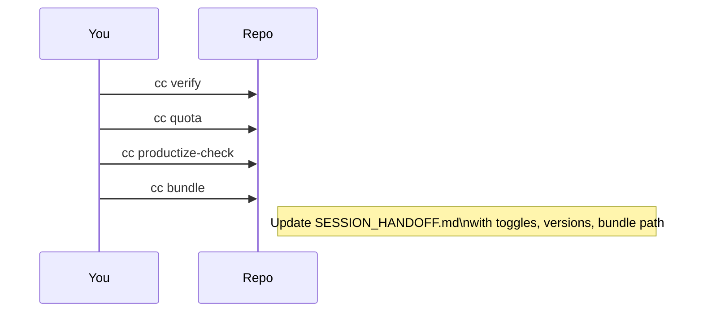

# 📦 Session Wrap & Handoff

Finish cleanly with metrics and a sharable bundle.

## Check usage and safety

```bash
cc quota
cc productize-check
```

- Quota shows Z.AI calls/tokens in the last 5h window.
- Productize‑check re-runs `cc verify` and confirms no auth header leaks.

## Bundle artifacts

```bash
cc bundle
# → ~/Downloads/agentos_tmp_review-<timestamp>.tgz
```

Included: results/METRICS.json, logs/usage.jsonl, key docs, addon scripts, Makefile, and a state summary.

## Update session notes

In `docs/SESSION_HANDOFF.md` add:

- Window tag (e.g., W0-CHN)
- commit_start / commit_end
- Toggles used (`MITM_FORCE_H1`, `ZAI_HEADER_MODE`, etc.)
- Key commands executed (start, prove, work, wrap)
- Versions (cc doctor output, optional `scripts/print-versions.sh`)
- Bundle path

### Optional tracker completion (if you’re using the tracker)

```bash
PYTHONPATH=~/git/tools/agentos/tracker/src \
python -m tracker.cli complete --window W0-CHN \
  --codex-features <#> --claude-features 0 \
  --quality 1.0 --outcome pass --methodology mitm_offload \
  --commit-start <commit_start> --commit-end $(git rev-parse HEAD)

PYTHONPATH=~/git/tools/agentos/tracker/src \
python -m tracker.cli churn --window W0-CHN \
  --provider codex --methodology mitm_offload
```


