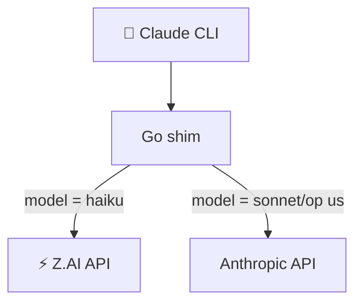
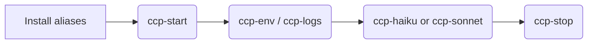
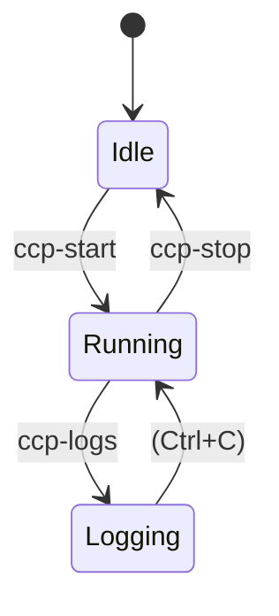

# 🦀 Claude Code Companion Architecture

Claude Code Companion (CCC) sits between the Claude CLI and the Anthropic/Z.AI APIs. Haiku requests are rerouted to ⚡ Z.AI for cost savings, while Sonnet/Opus remain on Anthropic. The Go shim (`services/go-anth-shim`) handles routing, headers, and logging.

```
             🦀 Claude CLI
                  │
                  ▼
       ┌──────────────────────┐
       │ ccp-start / go shim  │
       └──────────────────────┘
                 │   │
                 │   └─────────► ⚡ Z.AI (Haiku)
                 │
                 └─────────────► Anthropic (Sonnet/Opus)
```

## Request flow (Mermaid)



## Daily operations



### State flow (simplified)



## Key components
- **Go shim** (`services/go-anth-shim/cmd/ccp`) – routes, scrubs headers, logs usage.
- **MITM add-ons** (`services/mitm-subagent-offload`) – optional Python path for advanced logging.
- **Shell helpers** (`scripts/shell/ccc-aliases.sh`) – one-command start/stop/log.
- **Smoke tests** (`make smoke-license`) – verifies Haiku→Z.AI and license toggles.

## Emojis legend
- 🦀 – Claude Code CLI UI.
- ⚡ – Z.AI lane.
- 📜 – SOP or doc references.

## References
- 📜 `docs/SOP/install-ccc-aliases.md`
- 📜 `docs/ops/environment-profiles.md`
- 📜 `docs/Tasks/mitm_strip_thinking.plan.md`
