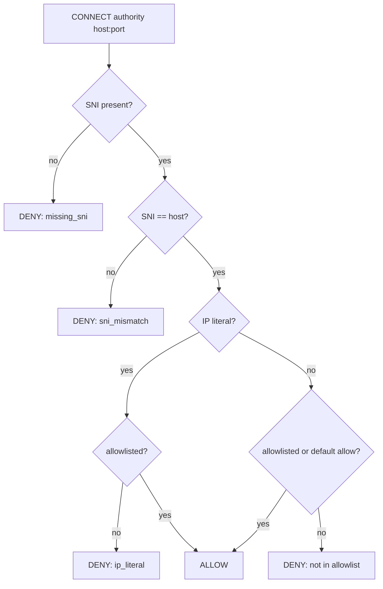

Below is a **single, hand‑offable doc** you can paste into the repo (e.g., `docs/POLICY-ARCHITECTURE.md`).
 It explains **how the policy system works**, **how we protect IP**, and **what L2 must do now**. I’ve included **Mermaid diagrams** and grounded it in the L0/L1 briefs you shared. After the doc you’ll find a **concise “Give this to L2 now” checklist**.

------

# Policy Packs & Proxy Hardening — Architecture (L1 → L2)

**Scope.** Turn the current Go shim + proxy hardening work into a **micro‑SaaS**: behavior is driven by a **signed policy pack** delivered from a control plane (can be hosted on GitHub Pages to start), enforced locally by the Go shim and the sandbox runtime (bwrap + optional seccomp). **No payload decryption; no body logs.**  

------

## 1) Goals (what policies control)

- **Routing**: map *model patterns* → *provider lanes* (e.g., `claude-haiku-* → Z.AI`, `sonnet/opus → Anthropic`). Enforce **header isolation** (no cross‑lane auth). 
- **Fronting hygiene** (forward proxy path): **CONNECT host must match SNI**, **block missing SNI**, **block IP‑literal** unless explicitly allow‑listed with TTL. Preserve **SSE**; never buffer. 
- **Sandbox egress** (Linux): **unshare net**, force egress via **Unix‑socket bridge** to the host proxy; apply **allowlist** at the proxy. 
- **Process isolation** (Linux): **Bubblewrap** for namespaces/FS policy; optional **seccomp (cBPF)** to deny high‑risk syscalls (`mount`, `bpf`, `perf_event_open`, `ptrace`, etc.). 

**Invariants:** *No body logging*, *SSE preserved (no buffering)*, *no cross‑lane header leaks*, *auth passthrough for Anth lane*. 

------

## 2) Policy pack format (MVP)

A compact, signed JSON fetched at start (and periodically). **Integrity via Ed25519 signature**; **no secrets in the pack**.

```json
{
  "schema": "ccp.policy.v1",
  "version": "2025-10-21.1",
  "ttlSeconds": 3600,
  "routing": {
    "matchers": [
      {"pattern": "claude-haiku-*", "lane": "zai"},
      {"pattern": "claude-sonnet-*", "lane": "anth"}
    ]
  },
  "providers": {
    "zai": {
      "baseURL": "https://api.z.ai/api/anthropic",
      "authHeader": {"mode": "x-api-key", "env": "ZAI_API_KEY"}
    },
    "anth": {
      "baseURL": "https://api.anthropic.com",
      "authHeader": {"mode": "bearer", "passthrough": true, "fallbackEnv": "ANTHROPIC_AUTH_TOKEN"}
    }
  },
  "fronting": {
    "requireSNI": true,
    "requireHostEqSNI": true,
    "blockIPLiteral": true,
    "allowlist": [
      {"hostport": "api.anthropic.com:443", "ttl": "P7D"},
      {"hostport": "api.z.ai:443", "ttl": "P7D"}
    ]
  },
  "sandboxLinux": {
    "bwrap": {
      "net": "restricted",
      "fs": {
        "roRoot": true,
        "rwOverlays": ["./work", "/tmp/ccp-cache"],
        "readDeny": ["/home/*/.ssh", "/home/*/.aws", "/home/*/.config/**"]
      }
    },
    "seccomp": {"profile": "baseline-blocklist", "exceptions": []}
  },
  "telemetry": {"localOnly": true}
}
```

**Signature files (shipped alongside):**

- `policy.pack.json` (public, cacheable)
- `policy.sig` (Ed25519 over the JSON)
- The shim embeds the **public key** and **refuses unsigned/expired** packs.

**Why this protects IP:** the **“secret sauce” lives in your signer + pack builder**, not in the client. Public hosting (e.g., GH Pages) is safe because integrity is enforced locally and **packs contain no credentials**. Provider keys are pulled from local env at enforcement time. 

------

## 3) How it works (end‑to‑end)

### 3.1 Boot & verify

```mermaid
sequenceDiagram
  participant Shim as Go Shim (local)
  participant Store as Policy Store (e.g., GH Pages)
  participant Verify as Ed25519 Verify
  participant Runtime as Sandbox Runtime (bwrap/seccomp)
  Note over Shim: Start with embedded "fallback policy"

  Shim->>Store: GET policy.pack.json + policy.sig
  Shim->>Verify: Verify(sig, json, pubKey)
  alt OK + not expired
    Shim->>Shim: Activate new policy (hot‑swap)
  else Fail/Expired
    Shim->>Shim: Keep fallback; warn only
  end
  Shim->>Runtime: Apply sandbox knobs (bwrap/seccomp modes)
```

- **Fallback** prevents bricking when offline or on bad sig. **Hot‑swap** is atomic.
- **No secrets** in the pack; only **rules and endpoints**. Auth comes from env/passthrough at request time. 

### 3.2 Request decision (routing + headers)

```mermaid
flowchart LR
  C[Client (Claude CLI/UI)] -->|HTTP JSON/SSE| S[Go Shim]
  S -->|model match| R[Routing Matrix]
  R -->|lane:zai| Z[Z.AI Adapter]
  R -->|lane:anth| A[Anth Adapter]

  Z -->|strip anth auth| HZ[Auth: x-api-key from env]
  A -->|pass Authorization| HA[Auth: bearer passthrough or fallbackEnv]

  HZ --> UZ[(https://api.z.ai)]
  HA --> UA[(https://api.anthropic.com)]
```

- **Model → lane** is purely policy‑driven (haiku → Z.AI; sonnet/opus → Anth).
- **Header isolation** enforced per lane; **SSE** responses stream unchanged. 

### 3.3 Sandbox egress (Linux)

```mermaid
flowchart LR
  subgraph Host
    PG[Proxy‑Guard (HTTP/SOCKS)\nSNI=CONNECT host, block IP literal, TTL allowlist]
    Br[Unix socket bridges]
  end
  subgraph Sandbox["bwrap namespaces"]
    Task[Tool/Build/Test (PID 1)]
    LHTTP[HTTP :3128]
    LSOCKS[SOCKS :1080]
  end

  Task --> LHTTP --> Br --> PG --> Internet
  Task --> LSOCKS --> Br --> PG --> Internet
```

- Sandbox has **no external net**; only loopback to the local listeners.
- Bridges forward to the **host proxy**, which enforces **fronting policy** and allowlist TTLs.  

------

## 4) IP protection (practical, today)

**What we keep server‑side**

- The **policy generator** (routing heuristics, allowlists, toggles).
- The **signing key** and **rotation**.
- Optional: **per‑tenant lanes/features** encoded into the pack (e.g., route `haiku-pro` only for paid tenants).

**What the client enforces**

- Reject unsigned/expired policy (Ed25519).
- No secrets in pack; **auth from env/passthrough only**.
- **Hygiene gates** (no body logs, SSE intact, header isolation) are *hard rules* in the shim/proxy. 

**Why GitHub Pages is OK (for MVP)**

- We rely on **content signature**, not transport secrecy, and we publish **non‑secret** rules.
- Add a **pinned SHA‑256** (SRI‑style) to catch accidental uploads; keep a **baked‑in fallback** for offline.
- Later: move to a private bucket or an authenticated endpoint without changing the client.

------

## 5) Linux sandbox details (L2 focus)

**Bubblewrap (bwrap) policy knobs**

- **Namespaces**: `--unshare-pid`, `--unshare-net`; fresh `/proc` in secure mode; nested‑CI fallback omits `--proc`.
- **FS**: **RO root** + targeted **RW overlays**; hide sensitive reads via `--tmpfs`/`/dev/null` binds.
- **Egress**: bind Unix sockets; start in‑ns listeners; all traffic goes to host proxy allowlist.
   (See *BwrapDesign_MentalModel.md* for exact argv and failure modes.)  

**Seccomp baseline (cBPF) — blocklist MVP**
 Deny kernel‑dangerous primitives and fronting bypasses (`mount`, `pivot_root`, `unshare`, `setns`/`clone3(CLONE_NEW*)`, `perf_event_open`, `bpf`, `ptrace`, `keyctl`, `open_by_handle_at`, `name_to_handle_at`, and **ioctl(TIOCSTI)** unless `--new-session`). Provide a small “exceptions” list if a task needs one. Include **5 denial tests** (mount/unshare/perf/bpf/ptrace|keyctl/TIOCSTI). 

------

## 6) What L2 builds now (DoD)

From **Addendum_Spawn_L2.md**: L1 must **spawn and manage L2** immediately; L2 delivers **cBPF profile(s)**, **bwrap loader usage**, **5 denial tests**, and a **report**, integrated into the **Unified Test Harness** and runtime flags. 

**Work items (ready‑to‑start):**

1. **Policy loader (Linux‑only path)**
   - A tiny module that takes `sandboxLinux.bwrap` + `sandboxLinux.seccomp` from the policy pack and renders **bwrap argv** and **seccomp FD**.
2. **Seccomp “baseline‑blocklist”**
   - Ship cBPF for the deny set above; support an *exceptions* list per task. Provide a `--seccomp=baseline` runtime flag & test hook. 
3. **5 denial tests (harness)**
   - `unshare -n true` → **blocked**
   - `mount -t tmpfs tmpfs /mnt` → **blocked**
   - `perf stat ls` → **blocked**
   - `bpf()`/`ptrace` probe → **blocked**
   - `ioctl(TIOCSTI)` injection → **blocked** (or require `--new-session`) 
4. **Proxy bridge contract**
   - Confirm the Unix‑socket bridge and local listeners sequence (bwrap + `socat` pairs) and report denials to our event bus. 
5. **Docs**
   - One‑pager summarizing the applied policy, argv snapshots (redacted), and test results; wire to the bundle paths we already use. 

**Acceptance gates (for the L2 package)**

- All 5 denial tests **pass** in CI (with nested‑CI fallback documented).
- Shim/proxy **hygiene gates remain green** (routing, SSE, no body logs).
- Bundle produced with metrics + report in expected paths. 

------

## 7) Where this fits the current repo & handoffs

- **Go shim** already satisfies routing + SSE + header isolation; L2 work is **orthogonal** and hangs under a new `proxy-guard/` area described in the L1 brief (Python reference + Go port mirrored) and then connects to the sandbox runtime via the Unix‑socket bridge.  
- Use the **non‑interactive harness** & artifacts layouts we already standardized (METRICS.json, usage logs, bundles).  

------

## 8) Risks & mitigations

- **Public hosting of policy:** mitigate with **signature + TTL + fallback**; avoid including secrets.
- **Sandbox compat (nested containers):** auto‑downgrade `/proc` isolation; keep seccomp deny set intact; log a **“weaker nested”** banner. 
- **SSE regressions:** tests ensure no buffering on streams (fronting + shim). 
- **False positives in fronting rules:** scope wildcards carefully; keep **per‑domain TTL allowlist** override. 

------

## 9) Minimal operator controls (MVP)

- Shim: `--policy-url`, `--policy-pubkey`, `--policy-refresh=60s`, `--policy-offline-ok` (use fallback).
- Proxy‑Guard: `--strict-fronting on|off` (default **on**), `--policy <path>`. 
- Sandbox: `--seccomp=baseline|off`, `--nested-compat=yes|no`.

------

# “Give this to L2 now” (copy/paste brief)

**Role:** L2‑Seccomp (reports to L1‑ProxyHardening).
 **Mission:** Deliver Linux sandbox enforcement and tests; integrate with our harness; keep lane hygiene and SSE invariants untouched.

**Inputs:**

- `docs_linux/BwrapDesign_MentalModel.md` (argv strategy, bridges, FS policy) 
- `docs_linux/Seccomp_Base_Profile.md` (deny set + tests) 
- `docs/HANDOFF-CONSOLIDATED-SESSION.md` (artifacts & gates) 

**Deliverables (DoD = all green):**

1. **cBPF baseline profile** (“baseline‑blocklist”) + loader; exceptions file.
2. **bwrap loader** that materializes argv from policy JSON.
3. **5 denial tests** (unshare, mount, perf, bpf/ptrace|keyctl, TIOCSTI) wired into the **Unified Harness**.
4. **One‑pager report + artifacts** (metrics JSON, logs, bundle) in the same paths as our shim proofs. 

**Constraints & invariants:** no body logs; SSE preserved; header isolation unchanged.
 **ACK phrase on completion:** `ACK L1‑ProxyHardening v1`. 

**Suggested repo scaffold (under a new top‑level):**

```
proxy-guard/
  py/…     # reference impl (optional if time-boxed)
  go/…     # Go port (optional next)
  shared/
    allow.schema.json
    examples/allow.min.json
sandbox-runtime/
  linux/
    bwrap_loader.sh
    seccomp/
      baseline_blocklist.cbp
      exceptions.json
tests/
  proxy/   # fronting & SSE tests
  sandbox/ # 5 denial tests
```

(Structure mirrors the Kickoff brief for Proxy‑Guard to simplify future Go porting.) 

------

## 10) What L0 should see next

- **Micro‑SaaS readiness:** policy‑driven shim live; signed packs; local enforcement; Linux sandbox DoD in CI; bundles produced.
- **Roadmap hooks:** knobs exist to move packs from GH Pages → private store without changing clients; per‑tenant toggles are server‑side.

------

### Appendix A — Fronting decision (CONNECT)



*(Implements the Kickoff brief tests and TTL allowlist behavior.)* 

------

### Appendix B — Minimal strict bwrap argv (reference)

```text
--unshare-pid --proc /proc
--unshare-net --bind /tmp/http.sock /tmp/http.sock --bind /tmp/socks.sock /tmp/socks.sock
--setenv HTTP_PROXY http://127.0.0.1:3128 --setenv HTTPS_PROXY http://127.0.0.1:3128
--ro-bind / / --bind ./work ./work --bind /tmp/ccp-cache /tmp/ccp-cache
--tmpfs /home/$USER/.ssh --tmpfs /home/$USER/.aws --tmpfs /home/$USER/.config
--dev /dev -- bash -c "<start socat listeners; trap; exec user-cmd>"
```

(Per mental model doc; nested‑CI omits `--proc`.) 

------

## What you can hand L2 & start in parallel

- This doc.
- The three source docs already in the repo: **BwrapDesign_MentalModel.md**, **Seccomp_Base_Profile.md**, **HANDOFF‑CONSOLIDATED‑SESSION.md** (for artifacts/acceptance gates).   
- The **Kickoff brief** for Proxy‑Guard so L2 understands the proxy’s contract and how the sandbox will reach it. 

If you want, I can also drop this as `docs/POLICY-ARCHITECTURE.md` plus a tiny `shared/policy.example.json` and `shared/policy.pubkey.example` so the next coding agent can wire the fetch/verify path immediately.