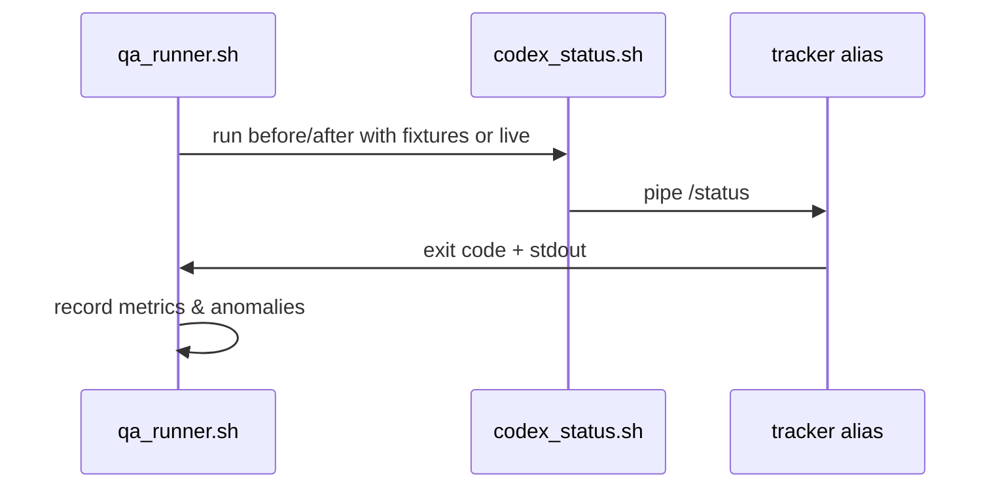

# Automation QA Harness

## 🎯 Why Now
- Automation scripts (`codex_status.sh`, upcoming Claude wrapper) are critical to reliable ingest; regressions would silently corrupt data.
- We need a repeatable way to exercise the wrappers against fixtures and live runs, logging anomalies (lagging panes, missing resets).
- Ensures we can validate automation after script updates or CLI version bumps.

## 🔗 Contracts (Depends, Emits)
- Depends on: `scripts/automation/*.sh`, alias CLI (`tracker alias`).
- Emits: QA report (JSON/Markdown) with capture status, lag time, anomalies, plus optional entry in `docs/Ledgers/Automation_Log.csv`.

## 🧭 Diagram

## ✅ Acceptance
- CLI `scripts/automation/qa_runner.sh` runs Codex + Claude wrappers (fixture mode) and verifies `source=automation` snapshots.
- Optional `--live` flag captures real panes and records lag metrics (time between polls, percent changes).
- pytest/behave coverage ensures QA runner exits non-zero on failure and logs anomalies.
- README/SOP updated with instructions for running the harness pre-release.

## 🧪 Operator Quick Cue
- Command: `scripts/automation/qa_runner.sh --provider codex --fixture tests/fixtures/automation/...`
- Check: report shows `source=automation` entries and zero failures; for `--live`, confirm lag metrics within expected range

## ⏱ Token Budget
- Estimate: **35K tokens** (shell harness + tests + docs).

## 🛠 Steps
1. Create QA runner script supporting `--provider`, `--fixture`, `--live`, and output report path.
2. Wire into pytest via `subprocess` tests for fixture mode.
3. Add Behave scenario exercising QA runner in fixture mode.
4. Document usage (README, recipe) and add to Saturday prep optional checks.
5. Capture first live run results in progress/hand-off for reference.
