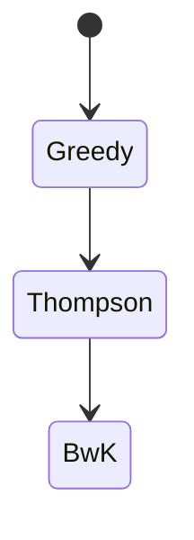

# Bandit Roadmap (Phases)

## 🎯 Why Now
Route tasks to providers adaptively with budget constraints and measurable gains.

## Phases
1) ε‑greedy on quality‑per‑cost with step penalty
2) Thompson Sampling with context (tags, time buckets)
3) BwK (Bandits with Knapsacks) to respect capacity budgets

## 🧭 Diagram (Mermaid stateDiagram)

## 🔗 Contracts
- Depends: features ledger, stats
- Emits: provider selection decisions per task

## ✅ Acceptance
- Simulated replay shows lift over naive baseline; decisions logged.
- Each phase requires sign-off and replay validation before live routing; earlier phases stay active until metrics prove safety.

## ⏱ Token Budget
~12K

## 🛠 Steps
1) Phase 1 policy + replay
2) Phase 2 with contexts
3) Phase 3 BwK prototype
