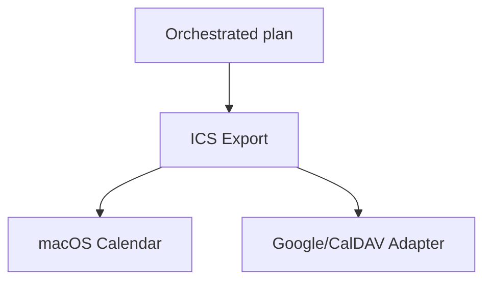

# Calendar Adapter (ICS / CalDAV) [Draft]

## 🎯 Why Now
- Provide alarms inside preferred calendar apps; share schedule without altering personal calendars.

## 🔗 Contracts (Depends, Emits)
- Depends: Session Scheduler, ICS spec.
- Emits: `docs/Schedule/week.ics`, optional Google/CalDAV uploader.

## 🧭 Diagram

## ✅ Acceptance
- Generates ICS file with alarms for start/end/ccusage; subscribable via macOS Calendar.
- Optional adapter uploads to Google Calendar when configured.

## 🧪 Operator Quick Cue
- Command: `scheduler/export_calendar.py --week 2025-10-27 --ics docs/Schedule/week.ics`
- Check: calendar shows events with 10m reminders; alarms fire locally

## ⏱ Token Budget
- 6K

## 🛠 Steps
1. Map plan to ICS events with alarms
2. Document subscription steps
3. Optional: add Google/CalDAV integration (with creds)

## ⚠ Risks
- Credential management for cloud adapters → keep optional and disabled by default

## 📎 Links
- `docs/Backlog/week_orchestrator.md`, `docs/SOP/scheduling_and_alerts.md`
