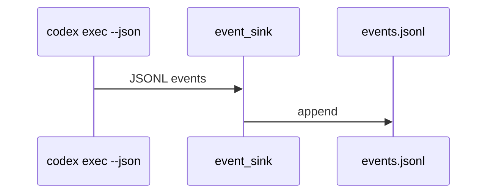

# Codex Event Sink (exec --json)

## 🎯 Why Now
Capture Codex events (commands, file changes, errors) and enrich sessions/timeline.

## 🔗 Contracts
- Depends: Automation
- Emits: data/events.jsonl for Timeline

## 🧭 Diagram (Mermaid sequence)

## ✅ Acceptance
- events.jsonl populated during automation; basic parser tested.
- Events are written under a `.gitignore`d path by default; redaction is optional and deferred unless logs are shared externally (can be toggled later).

## ⏱ Token Budget
~10K

## 🛠 Steps
1) Extend automation to capture --json stream
2) Parser to validate/trim
3) Timeline integration
