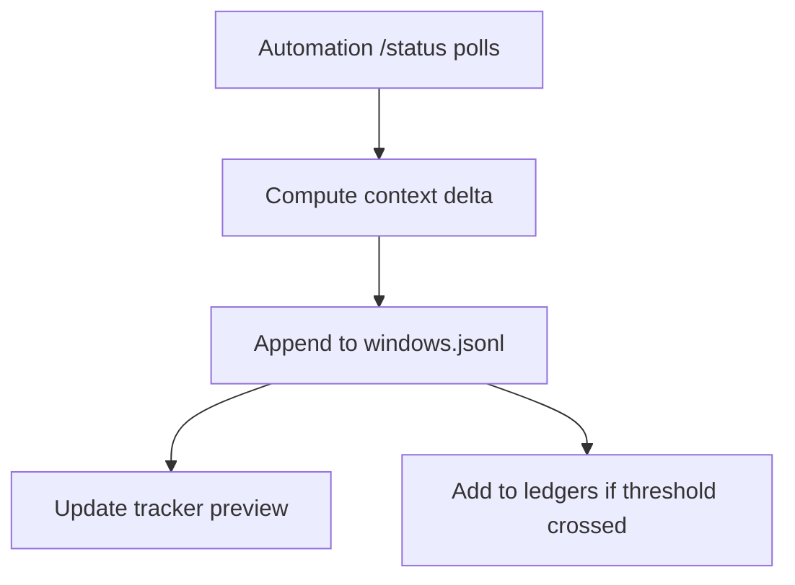

# Context Reclaim Metrics

## 🎯 Why Now
- Codex prunes old reasoning when the transcript grows; we observed context swinging from 20% to 39% remaining within a minute.
- Without metrics we can’t quantify how often pruning happens or whether we are still close to the limit.
- Preview and ledgers need a concise signal to warn operators when they should poll `/status` again or trim prompt history manually.

## 🔗 Contracts (Depends, Emits)
- Depends on: `scripts/automation/codex_status.sh`, `data/week0/live/snapshots.jsonl`
- Emits: Additional fields in `windows.jsonl` (e.g., `context_reclaimed_pct`), preview lines, optional anomalies log when pruning fails.

## 🧭 Diagram

## ✅ Acceptance
- Each finalized window stores the largest reclaimed percentage (if any) between successive `/status` panes.
- Preview shows `context_reclaimed=X%` when pruning occurred; hides the line when zero.
- Add pytest coverage for the delta computation (fixtures with multiple panes) and Behave scenario ingesting before/after panes to assert preview output.
- Document operator guidance (README/SOP) so they know to poll twice.

## 🧪 Operator Quick Cue
- Command: `python -m tracker.cli preview --window <W0-XX>` after running `ox`
- Check: confirm a `context_reclaimed=` line appears with the expected percentage (or is absent when zero)

## ⏱ Token Budget
- Estimate: **30K tokens** (parser delta + storage + preview + tests + docs).

## 🛠 Steps
1. Extend automation wrapper to optionally log both the original and follow-up pane for deltas.
2. Implement helper that consumes snapshots for a window and calculates max reclaimed percent.
3. Store metric in `windows.jsonl` during `tracker complete`.
4. Update preview + unit/behave tests.
5. Document in README/SOP and add to UAT checklist.
