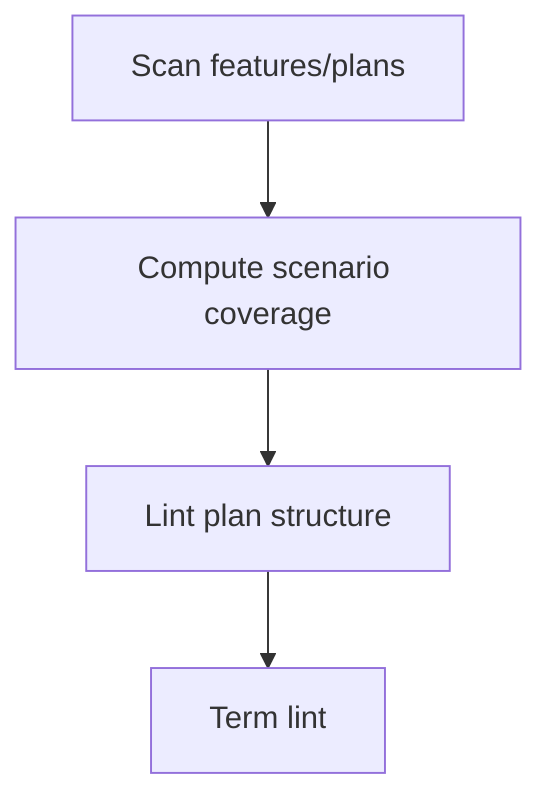

# Coverage & Plan/Term Lint

## 🎯 Why Now
Keep spec coverage high and plans consistent; prevent terminology drift (methodologies vs workflows).

## 🔗 Contracts
- Depends: features/, plans/, glossary
- Emits: coverage table, lint warnings

## 🧭 Diagram (Mermaid flowchart)

## ✅ Acceptance
- Coverage table generated; plan lint fails missing sections; term lint lists offenders.

## ⏱ Token Budget
~11K

## 🛠 Steps
1) spec_coverage.py
2) plan_lint.py
3) term_lint.py + glossary terms
