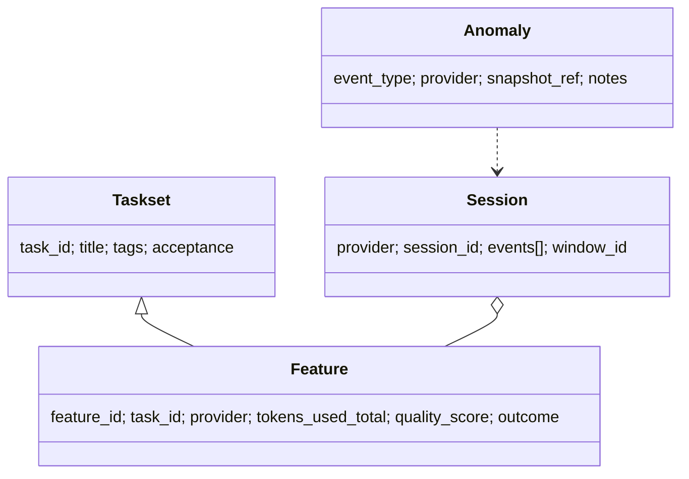

# Data Schemas & Ledgers

## 🎯 Why Now
Create canonical JSONL ledgers for tasks, features, sessions, and anomalies so every metric is computed once and reused everywhere.

## 📦 Scope
| Item | Fields (core) |
| --- | --- |
| taskset.jsonl | task_id, title, tags[difficulty, area], acceptance_criteria |
| features.jsonl | feature_id, task_id, provider, model, window_id, start_at, end_at, duration_min, tokens_used_total, quality_score, outcome, commits, lines_added, lines_deleted |
| sessions.jsonl | provider, session_id, events[type, ts, payload], window_id |
| anomalies.jsonl | event_type, provider, snapshot_ref, notes, resolved_at |

## 🔗 Contracts
- Depends: none
- Emits: stable inputs for Timeline, Stats/CI, Routing (Bandits), Preview

## ✅ Acceptance
- Schemas documented and versioned; append‑only writes; validated in unit tests.

## 🧭 Diagram (Mermaid classDiagram)

## ⏱ Token Budget
~12K (docs + stubs + tests)

## 🛠 Steps
1) Write schema docs + dataclasses or Pydantic models
2) Add JSONL append/load helpers; add tests
3) Wire into preview as “data present ✓/✗”

