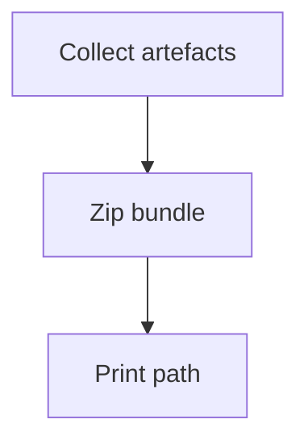

# Deliverables Bundler

## 🎯 Why Now
One‑click bundle of plan, TLDR, ledgers, feature log, timeline, and preview for handoff.

## 🔗 Contracts
- Depends: Preview, TLDR, Ledgers
- Emits: zip file with dated name

## 🧭 Diagram (Mermaid flowchart)

## ✅ Acceptance
- Bundle created and path logged in handoff.

## ⏱ Token Budget
~6K

## 🛠 Steps
1) build_bundle.sh
2) Docs + checklist entry
