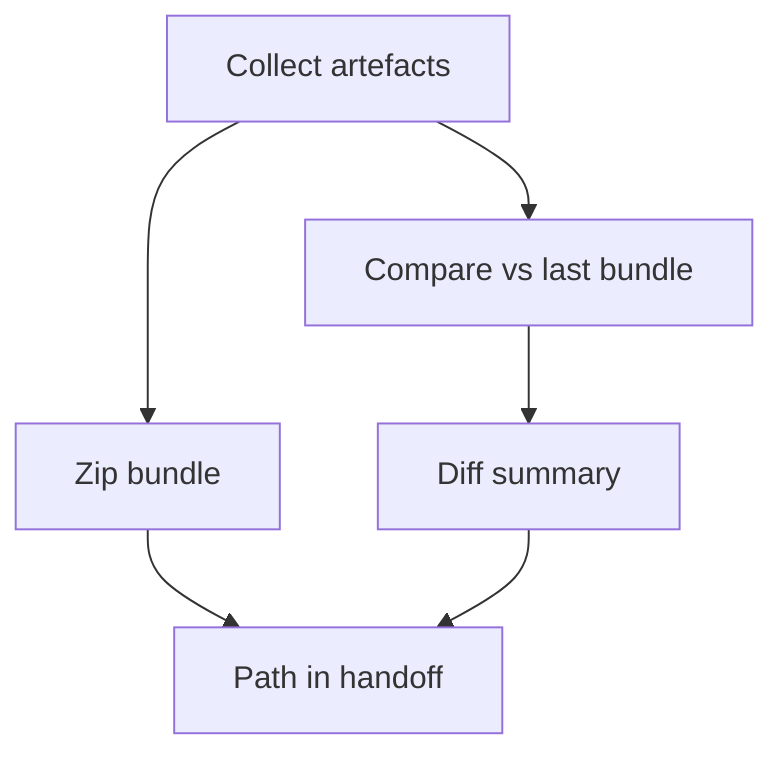

# Deliverables Bundler 2.0 (Diff‑Aware) [Draft]

## 🎯 Why Now
- Speed review by bundling outputs and producing a one‑page diff vs last session’s bundle.

## 🔗 Contracts (Depends, Emits)
- Depends: plan, TLDR, ledgers, windows.jsonl, preview snapshot
- Emits: bundle zip + diff report

## 🧭 Diagram (Mermaid flowchart)

## ✅ Acceptance
- Produces a zip and a concise diff summary; path recorded in handoff.
- Ensures secrets are excluded; respects `.gitignore`d event logs.

## 🧪 Operator Quick Cue
- Command: `scripts/tools/build_bundle.sh --date 2025-10-21 --compare` (example)
- Check: zip created + diff markdown saved; handoff includes bundle path and diff summary reference

## ⏱ Token Budget
- Estimate: 10K

## 🛠 Steps
1. Extend bundler to locate previous bundle, compute md/ASCII diff.
2. Update recipe/checklist; add “bundle diff” to handoff.
3. Tests: missing previous bundle, large file lists.

## ✅ Good Fit
- Faster leadership review; clearer deltas.

## 🚫 Avoid
- Including sensitive logs by default; keep event sinks opt‑in.

## 📎 Links
- `docs/Backlog/deliverables_bundler.md`, `docs/SOP/session_reflection_sop.md`
