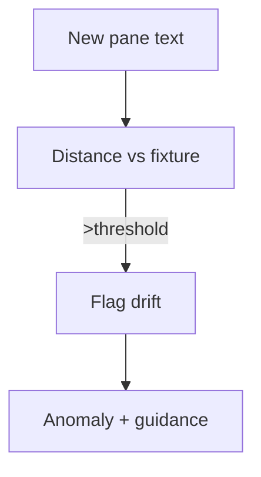

# Parser Drift Watchdog

## 🎯 Why Now
Detect Codex/Claude UI text drift early to avoid silent parse failures.

## 🔗 Contracts
- Depends: blessed fixtures
- Emits: anomalies.jsonl entries, test failures with remediation hints

## 🧭 Diagram (Mermaid flowchart)

## ✅ Acceptance
- Watchdog tests guard key sections; failing tests provide next steps.
- Thresholds/ignore lists prevent false positives; a human review step is required before blocking merges.

## ⏱ Token Budget
~9K

## 🛠 Steps
1) Distance checks per section
2) Thresholds + ignore lists
3) CI tests & docs
