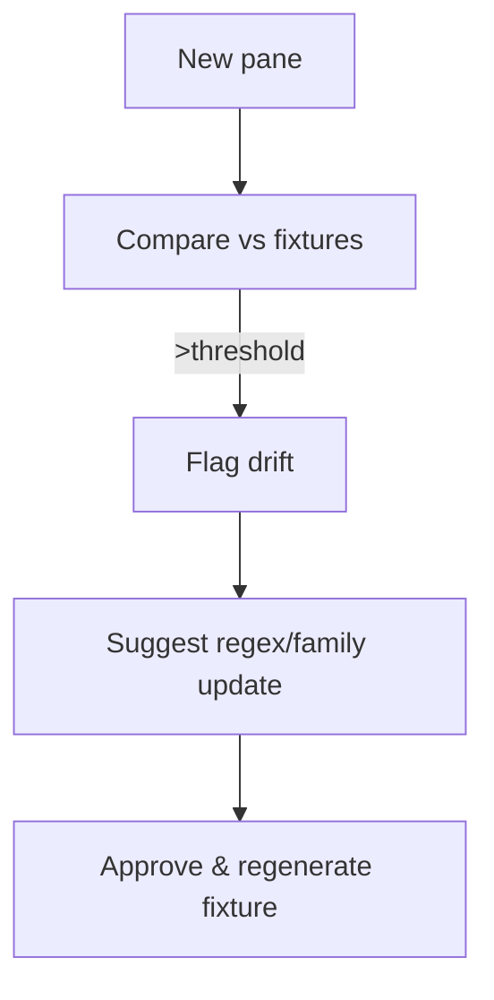

# Live Drift Sentry + Self-Healing Parsers [Draft]

## 🎯 Why Now
- Provider panes drift; catch changes early and recover fast with fixture families and regex regeneration.

## 🔗 Contracts (Depends, Emits)
- Depends: blessed fixtures, parser regex families
- Emits: anomalies.jsonl entries, regenerated fixtures on approval

## 🧭 Diagram (Mermaid flowchart)

## ✅ Acceptance
- Drift detector flags real wording changes; false positive rate low via thresholds/ignore lists.
- One‑liner regenerates fixtures after approval; tests stay green.

## 🧪 Operator Quick Cue
- Command: `python -m parsers.drift_check --provider codex --pane tests/fixtures/codex/...`
- Check: CLI reports `status=ok` or lists drift items with suggested regex updates; fixtures regenerate only after explicit approval

## ⏱ Token Budget
- Estimate: 16K

## 🛠 Steps
1. String distance checks per important field; thresholds and ignore lists.
2. Generator for regex families from golden examples.
3. Approve‑and‑regenerate flow; update tests.

## ✅ Good Fit
- Keeps parsers resilient with minimal operator time.

## 🚫 Avoid
- Autopatching without human review; always require explicit approval.

## 📎 Links
- `docs/Backlog/drift_watchdog.md`, `tracker/tests/test_parsers.py`
