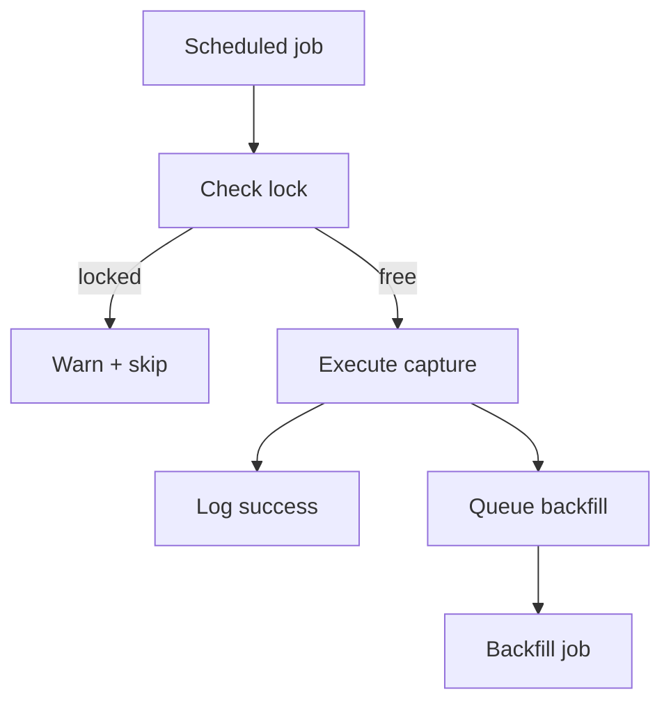

# Collision & Backfill Manager [Draft]

## 🎯 Why Now
- Prevent automation/manual clashes and recover gracefully when scheduled captures are missed.

## 🔗 Contracts (Depends, Emits)
- Depends: Session Scheduler, alias CLI, automation logs.
- Emits: lock files (`data/automation/locks/`), backfill annotations (`notes`, anomalies log).

## 🧭 Diagram

## ✅ Acceptance
- Lock prevents concurrent captures; manual run prints clear warning.
- Missed job triggers backfill that records `notes=backfill` in UPS/ledgers.

## 🧪 Operator Quick Cue
- Command: `scheduler/run_job.sh --job codex_after`
- Check: sees `lock ok` message when free; manual rerun with lock in place prints warning; backfill flag recorded in notes

## ⏱ Token Budget
- 8K

## 🛠 Steps
1. Implement lock file create/release
2. Integrate backfill queue
3. Document in scheduling SOP

## ⚠ Risks
- Stale locks; ensure timeout or manual clear procedure

## 📎 Links
- `docs/SOP/scheduling_and_alerts.md`, `docs/System/scheduler/overview.md`
