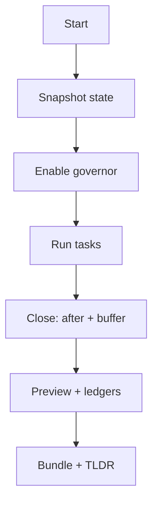

# Operator Wrappers (Start/Close Window)

## 🎯 Why Now
Reduce operator friction; ensure consistent capture/validation every window.

## 🔗 Contracts
- Depends: aliases, automation, snapshot tool
- Emits: clean lifecycle logs, ledgers appended

## 🧭 Diagram (Mermaid flowchart)

## ✅ Acceptance
- Start/Close scripts run end‑to‑end; produce expected artefacts consistently.

## ⏱ Token Budget
~9K

## 🛠 Steps
1) start_window.sh / close_window.sh
2) Docs + checklist entries
