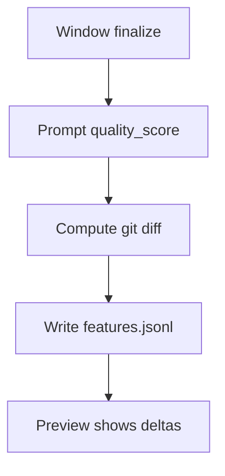

# Outcome & Quality Capture (complete)

## 🎯 Why Now
Make feature outcomes measurable: capture quality_score and outcome at window finalize; snapshot git churn.

## 🔗 Contracts
- Depends: CLI complete
- Emits: features.jsonl rows; churn fields for Stats/CI and Bandits

## 🧭 Diagram (Mermaid flowchart)

## ✅ Acceptance
- `tracker complete` requires/accepts quality and writes churn; preview summarizes.

## ⏱ Token Budget
~9K

## 🛠 Steps
1) Extend CLI complete; add churn snapshot
2) Append to features.jsonl; tests
3) Preview shows feature outcome and churn
