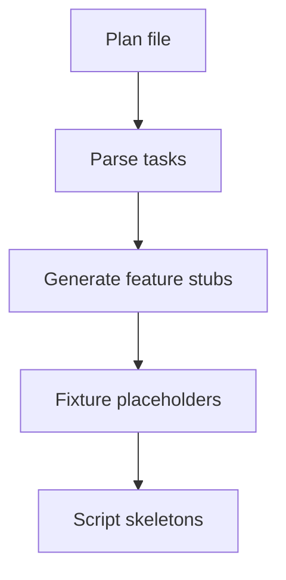

# Plan Compiler (spec-first maker)

## 🎯 Why Now
Reduce friction by auto‑generating feature stubs, steps, fixture dirs, and script skeletons from a plan.

## 🔗 Contracts
- Depends: plans/<date>
- Emits: .feature, steps, tests/fixtures/

## 🧭 Diagram (Mermaid flowchart)

## ✅ Acceptance
- Running compiler yields ccusage/automation stubs; logs paths in progress.md.
- Compiler marks generated files with `TODO` comments; placeholders must be replaced before calling a feature "done" (see DoD).

## ⏱ Token Budget
~10K

## 🛠 Steps
1) plan_compile.py (YAML/MD task blocks)
2) templates for stubs
3) dry‑run and write modes
