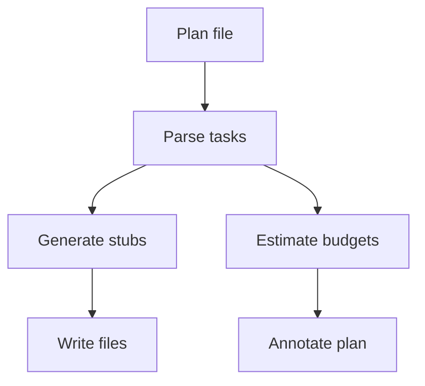

# Plan Compiler 2.0 (Dynamic, Budget‑Aware) [Draft]

## 🎯 Why Now
- Speed up spec‑first by generating stubs/scripts and predicting token budgets from history.

## 🔗 Contracts (Depends, Emits)
- Depends: plans/<date>, historical token ledger
- Emits: .feature/steps/fixtures/script stubs, budget estimates

## 🧭 Diagram (Mermaid flowchart)

## ✅ Acceptance
- Running compiler emits stubs and budget estimates; placeholders marked TODO.
- DoD blocks shipping with placeholders still present.

## 🧪 Operator Quick Cue
- Command: `python -m tooling.plan_compiler --plan plans/2025-11-01_next_session.plan.md`
- Check: generated stubs appear under `features/` with TODO markers and budget annotations in plan; rerun fails if placeholders remain

## ⏱ Token Budget
- Estimate: 15K

## 🛠 Steps
1. Parse plan task blocks.
2. Emit stubs and fixture folders; annotate plan with budgets from historical priors.
3. Add DoD guard in docs/tests.

## ✅ Good Fit
- Enforces spec‑first; reduces friction; stays offline.

## 🚫 Avoid
- Over-generating noise; keep outputs minimal and focused.

## 📎 Links
- `docs/Backlog/plan_compiler.md`, `docs/SOP/definition_of_done.md`
