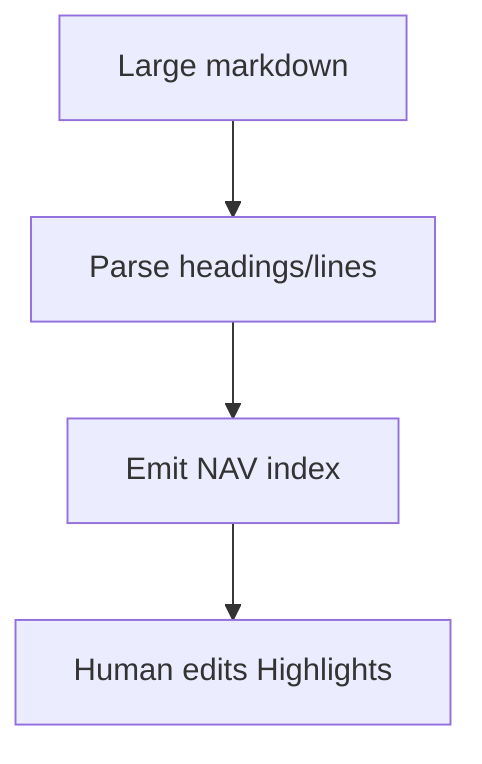

# Progressive NAV Generator

## 🎯 Why Now
Automate line‑indexed “NAV” files so large docs are easy to skim and cite.

## 🔗 Contracts
- Depends: Archive docs
- Emits: file.nav.md with `L` anchors

## 🧭 Diagram (Mermaid flowchart)

## ✅ Acceptance
- NAV files generated for top docs; curated summaries reference them.

## ⏱ Token Budget
~8K

## 🛠 Steps
1) build_nav_index.py
2) Make target & docs
