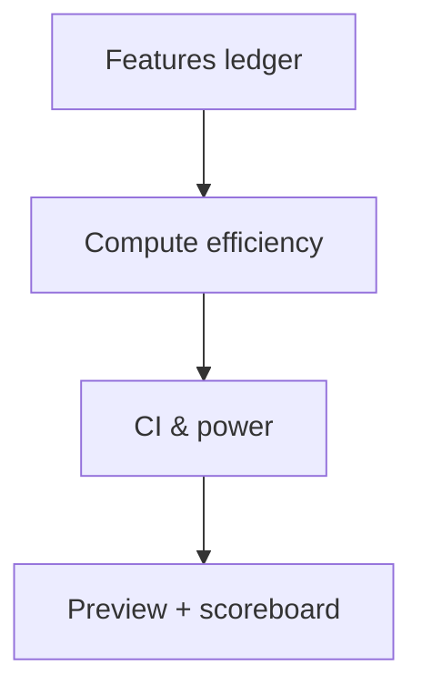

# Provider Scoreboard (CI/Power on Every Claim) [Draft]

## 🎯 Why Now
- Avoid decisions on low-n; show confidence on efficiency comparisons before routing.

## 🔗 Contracts (Depends, Emits)
- Depends: features ledger (quality, tokens)
- Emits: preview lines with n, CI, power; scoreboard markdown export

## 🧭 Diagram (Mermaid flowchart)

## ✅ Acceptance
- Preview shows `efficiency=.. ci=[..,..] n=.. power=..` for each provider.
- Defers recommendations when n<3.

## 🧪 Operator Quick Cue
- Command: `python -m tracker.cli --data-dir data/week0/live preview --window <W0-XX>`
- Check: look for provider lines with CI and power; verify `ci=n/a` when n<3

## ⏱ Token Budget
- Estimate: 14K

## 🛠 Steps
1. Stats helpers (CI/power for ratio-of-totals).
2. Print compact lines in preview; export scoreboard md.
3. Tests for low-n, edge values.

## ✅ Good Fit
- Transparent decisions; safer routing.

## 🚫 Avoid
- Over-promising with underpowered data.

## 📎 Links
- `docs/Backlog/stats_power_ci.md`, `docs/Backlog/what_if_efficiency.md`
