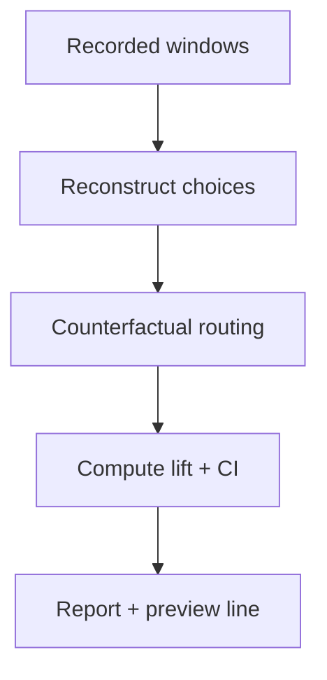

# Replay Simulator & Router Bench [Draft]

## 🎯 Why Now
- Prove routing gains offline before touching live sessions; derisk bandit phases.

## 🔗 Contracts (Depends, Emits)
- Depends: `data/week0/live/*.jsonl`, features ledger (quality, tokens)
- Emits: replay reports (lift vs baseline, CI/power), preview “replay lift” line

## 🧭 Diagram (Mermaid flowchart)

## ✅ Acceptance
- Given recorded windows, simulator outputs lift vs naive baseline with CI/power.
- Preview shows a compact “replay: +X% (CI)” line; defers when n<3.

## 🧪 Operator Quick Cue
- Command: `python -m analysis.replay --windows data/week0/live/windows.jsonl`
- Check: report summarises lift vs baseline with CI; preview displays `replay:` line when replay data exists

## ⏱ Token Budget
- Estimate: 22K

## 🛠 Steps
1. Deterministic replayer for recorded windows.
2. Counterfactual estimator using quality-per-cost.
3. CI/power helpers; print single‑line report and preview snippet.

## ✅ Good Fit
- Works entirely on local logs; repeatable; no live risk.

## 🚫 Avoid
- Over‑fitting on a small sample; show CI/power and gate on n≥3.

## 📎 Links
- `docs/Backlog/stats_power_ci.md`, `docs/Backlog/bandit_roadmap.md`
