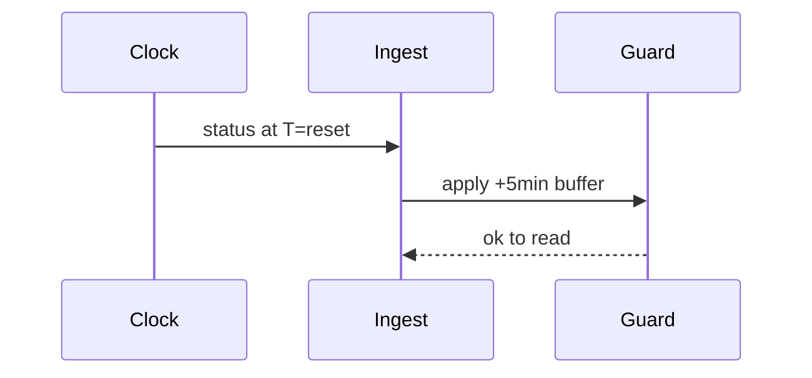

# Reset‑Edge Guardrails

## 🎯 Why Now
Make reset minutes safe: enforce lag buffer, non‑negative deltas, explicit reset markers.

## 🔗 Contracts
- Depends: ADR‑004
- Emits: stable before/after deltas; anomalies when violated

## 🧭 Diagram (Mermaid sequence)

## ✅ Acceptance
- Automation respects buffer; no negative deltas in windows; tests cover multi-pane.
- Provider resets are not hard-coded (e.g., 05:00/06:00). We record observed `reset_at` and infer via timeline; Codex 5h windows roll minute-by-minute.

## ⏱ Token Budget
~9K

## 🛠 Steps
1) Add guard calls to aliases/ingest
2) Negative-delta detector
3) Tests with multi-status fixture
