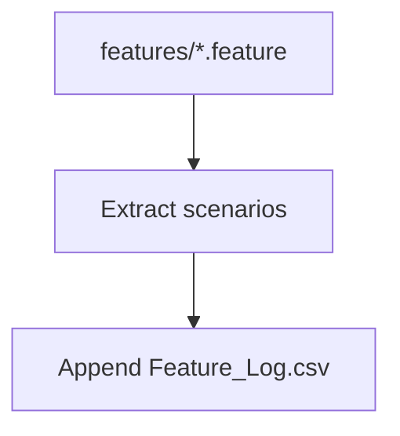

# Scenario Harvester

## 🎯 Why Now
Ensure shipped BDD scenarios are logged into the feature ledger automatically.

## 🔗 Contracts
- Depends: features/
- Emits: docs/Ledgers/Feature_Log.csv rows

## 🧭 Diagram (Mermaid flowchart)

## ✅ Acceptance
- Harvester writes new rows idempotently; includes file path + scenario name.

## ⏱ Token Budget
~8K

## 🛠 Steps
1) harvest_scenarios.py
2) Add to session close checklist
