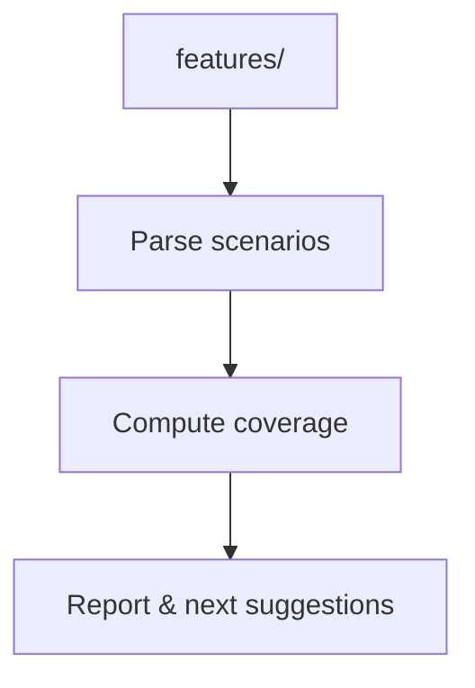

# Spec Coverage Map

## 🎯 Why Now
See feature/scenario gaps instantly to prioritize high‑value BDD work.

## 🔗 Contracts
- Depends: features/
- Emits: coverage table to console/markdown

## 🧭 Diagram (Mermaid flowchart)

## ✅ Acceptance
- Report lists missing steps and suggested scenarios; optionally writes a markdown table.

## ⏱ Token Budget
~7K

## 🛠 Steps
1) spec_coverage.py
2) Docs + progress integration
