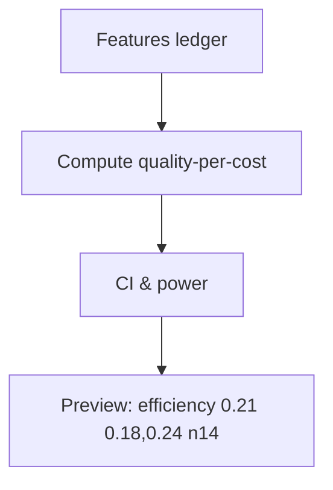

# CI/Power Stats & Preview

## 🎯 Why Now
Report confidence intervals and power so routing decisions aren’t based on underpowered samples.

## 🔗 Contracts
- Depends: features.jsonl with quality and tokens
- Emits: CI/power lines in preview; stats utils

## 🧭 Diagram (Mermaid flowchart)

## ✅ Acceptance
- Preview prints CI & n; stats util unit tests pass.

## ⏱ Token Budget
~11K

## 🛠 Steps
1) Implement ratio-of-totals CI + power helpers
2) Integrate into preview
3) Tests for edge cases (n small)
