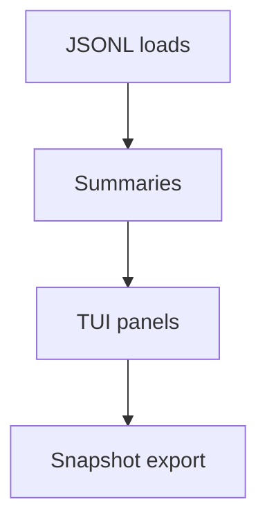

# Status Board TUI (Session Dashboard) [Draft]

## 🎯 Why Now
- Provide a fast, glanceable terminal view of windows, ccusage, resets, and sources to reduce operator overhead.

## 🔗 Contracts (Depends, Emits)
- Depends: JSONL stores, preview helpers
- Emits: TUI screen; optional markdown snapshot

## 🧭 Diagram (Mermaid flowchart)

## ✅ Acceptance
- TUI displays windows, provider stats, ccusage weekly/daily/session, reset clocks, and `(source/notes)` in snapshots.
- Runs without network; exits cleanly; has a “snapshot” key.

## 🧪 Operator Quick Cue
- Command: `python -m ops.status_board --data-dir data/week0/live`
- Check: panels render Codex/Claude/GLM stats, ccusage block, reset countdowns; `s` key exports markdown snapshot

## ⏱ Token Budget
- Estimate: 12K

## 🛠 Steps
1. Reuse preview logic; print panels via Rich/textual (optional) or plain ANSI.
2. Add a snapshot exporter (markdown block for handoff).
3. Document in README; optional demo GIF.

## ✅ Good Fit
- Zero‑click situational awareness; boosts long sessions.

## 🚫 Avoid
- Complex UI frameworks; keep it simple and portable.

## 📎 Links
- `docs/SOP/standard-operating-procedures.md`, `tracker/src/tracker/cli.py`
