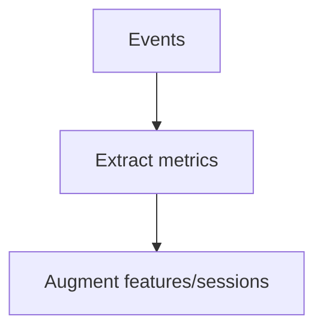

# Telemetry Extensions

## 🎯 Why Now
Complete the picture: message counts, error taxonomy, latency metrics.

## 🔗 Contracts
- Depends: Event Sink, features ledger
- Emits: enriched features/sessions fields for analysis

## 🧭 Diagram (Mermaid flowchart)

## ✅ Acceptance
- Metrics appear in preview; fields enter analysis notebooks.

## ⏱ Token Budget
~8K

## 🛠 Steps
1) Parsers for messages/errors/latency
2) Features/sessions augmentation
