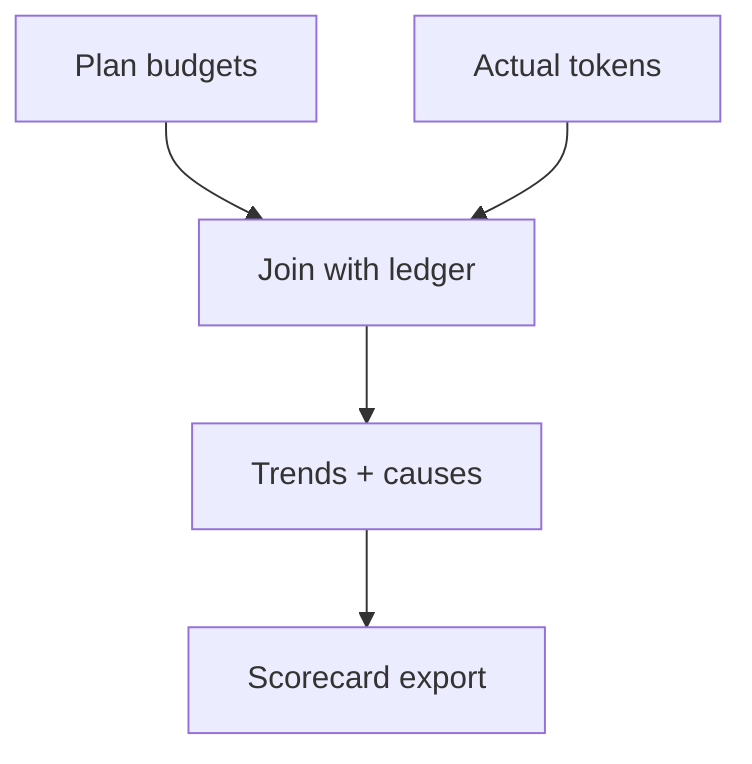

# Token Budget Scorecard (Plan vs Actual) [Draft]

## 🎯 Why Now
- Improve sizing discipline; learn from overruns and underspends across sessions.

## 🔗 Contracts (Depends, Emits)
- Depends: `docs/Ledgers/Token_Churn_Ledger.csv`, plans/<date>
- Emits: scorecard markdown with trends and causes

## 🧭 Diagram (Mermaid flowchart)

## ✅ Acceptance
- Generates a scorecard showing plan vs actual per session with short notes.
- Highlights >10% variance rows; links back to progress.md notes.

## 🧪 Operator Quick Cue
- Command: `python -m reporting.token_scorecard --plans plans/ --ledger docs/Ledgers/Token_Churn_Ledger.csv`
- Check: output markdown lists each session with plan vs actual %, highlights variances >10%, and references progress notes

## ⏱ Token Budget
- Estimate: 8K

## 🛠 Steps
1. Parse plan token budgets and ledger actuals.
2. Compute variance; emit markdown with highlights.
3. Link from progress.md; add to handoff bundle.

## ✅ Good Fit
- Simple, high signal; encourages better planning.

## 🚫 Avoid
- Shaming; keep notes constructive and actionable.

## 📎 Links
- `docs/SessionReports/*_TLDR.md`, `docs/SessionReports/*_Ideas.md`
