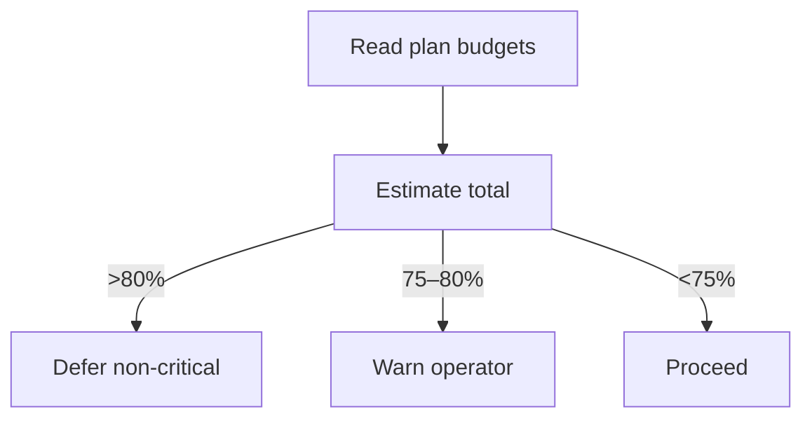

# Token Estimator + Session Governor

## 🎯 Why Now
Keep sessions inside 70–80% automatically; warn early, trim late.

## 🔗 Contracts
- Depends: plans/<date> (token budgets), Codex /status
- Emits: warnings >75%, defers non‑critical >80%

## 🧭 Diagram (Mermaid flowchart)

## ✅ Acceptance
- Synthetic over‑budget plan triggers a **warning**; operator can override with `--force`.
- Governor never blocks work outright; it only suggests trimming non‑critical tasks when >80%.

## ⏱ Token Budget
~14K

## 🛠 Steps
1) estimate_tokens.py (heuristics)
2) session_governor.sh (poll /status)
3) integrate into plan SOP
