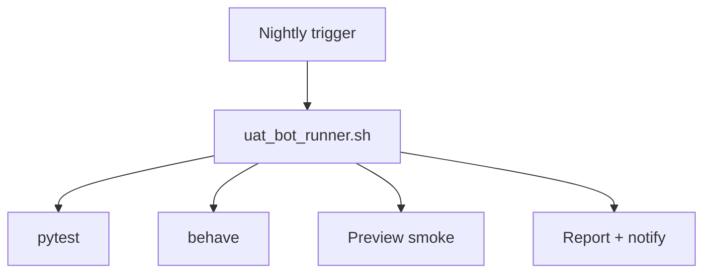

# UAT Bot Runner [Draft]

## 🎯 Why Now
- Automate fixture/live verification before each session and nightly, reducing manual regression work.

## 🔗 Contracts (Depends, Emits)
- Depends: pytest suite, behave suite, preview command, automation scripts.
- Emits: `reports/uat/<date>.md`, optional notifications on failure.

## 🧭 Diagram

## ✅ Acceptance
- Fixture mode runs all CLI tests and preview check; failures produce non-zero exit and report file.
- Optional live mode exercises wrappers with `--fixture` fallback.

## 🧪 Operator Quick Cue
- Command: `scripts/uat_bot_runner.sh --mode fixture`
- Check: report indicates pass/fail and lists commands run; failures escalate via scheduler alerts

## ⏱ Token Budget
- 10K

## 🛠 Steps
1. Implement shell runner with fixture mode
2. Integrate into scheduler/nightly job
3. Add reporting + notifications

## ⚠ Risks
- Live mode might consume capacity; keep optional and rate-limited

## 📎 Links
- `docs/Recipes/uat_bot_runner.md`, `docs/SOP/uat_opener.md`
