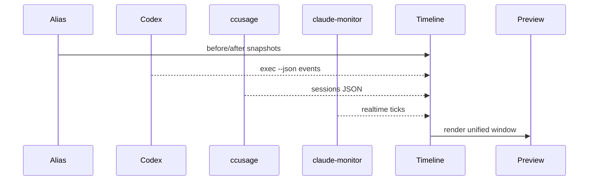

# Unified Timeline Builder

## 🎯 Why Now
Correlate alias snapshots, ccusage sessions, claude‑monitor ticks, and codex events into a single ordered stream.

## 🔗 Contracts
- Depends: Data Schemas & Event Sink
- Emits: timeline.json for preview; improves Bundle report

## 🧭 Diagram (Mermaid sequence)

## ✅ Acceptance
- Preview prints “Timeline:” block with ordered events and gaps marked.

## ⏱ Token Budget
~12K

## 🛠 Steps
1) Implement timeline builder with normalization
2) Add preview section + simple diff visual
3) Tests with mixed fixtures
