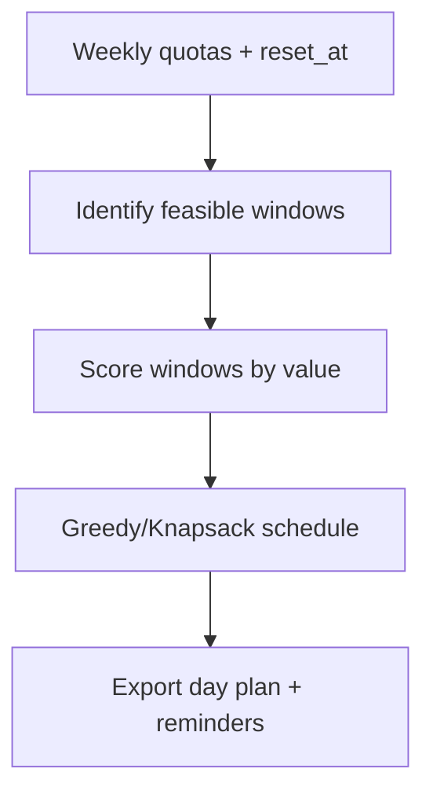

# Week Orchestrator (Rolling 5h + Weekly Knapsack) [Draft]

## 🎯 Why Now
- Optimize the whole week across rolling 5h Codex windows and weekly quotas while leaving headroom for planned work (70–80%).
- Reduce operator juggling; proactively schedule high‑value windows where they fit best.

## 🔗 Contracts (Depends, Emits)
- Depends: `docs/SOP/week0_final_protocol.md`, `data/week0/live/*.jsonl`, ccusage weekly/daily snapshots
- Emits: `plans/<date>_orchestrated.md` (calendar of windows), optional `.ics` export, notes for alias wrappers

## 🧭 Diagram (Mermaid flowchart)

## ✅ Acceptance
- Produces a dated plan listing window IDs, providers, target tasks, and reset-aware times.
- Keeps total token plan in 70–80% band; prints budget summary.
- Optional ICS file contains reminders; README explains import.

## 🧪 Operator Quick Cue
- Command: `python -m scheduler.orchestrate --week 2025-10-27 --export docs/Schedule/week.ics`
- Check: plan totals stay within 70–80% token band; calendar shows alarms at start/end + ccusage snapshot times

## ⏱ Token Budget
- Estimate: 20K (greedy MVP) → 35K (adds knapsack with OR‑Tools if available offline)

## 🛠 Steps
1. Extract constraints (weekly caps, 5h windows, reset_at) from JSONL + ccusage.
2. Greedy day planner that avoids reset edges; print per-day schedule.
3. Optional: knapsack refinement (value=task priority; cost=window tokens).
4. Export Markdown + optional ICS; add to Saturday prep as “orchestrate week”.

## ✅ Good Fit
- Offline scheduling from local data; clear export for operators.

## 🚫 Avoid
- Hard‑coding reset times; assume minute‑level rolling windows and record `reset_at`.

## 📎 Links
- `docs/System/contracts.md`, `docs/SOP/week0_final_protocol.md`, `docs/Tasks/tracker_cli_todo.md`
