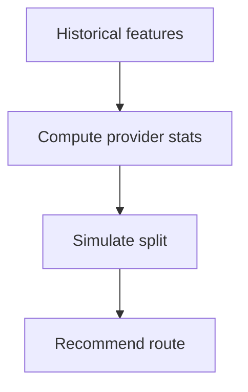

# What‑If Efficiency Estimator

## 🎯 Why Now
Pre‑flight provider choice for a window using historical features: suggest provider split and expected gains.

## 🔗 Contracts
- Depends: features.jsonl, stats utils
- Emits: preview “what‑if” line with recommendation

## 🧭 Diagram (Mermaid flowchart)

## ✅ Acceptance
- Preview prints recommendation and expected delta with CI; tests cover low‑n / cold‑start.
- If `n < 3`, estimator defers with a "insufficient data" message (no hard routing).

## ⏱ Token Budget
~11K

## 🛠 Steps
1) what_if.py estimator
2) Preview integration + docs
