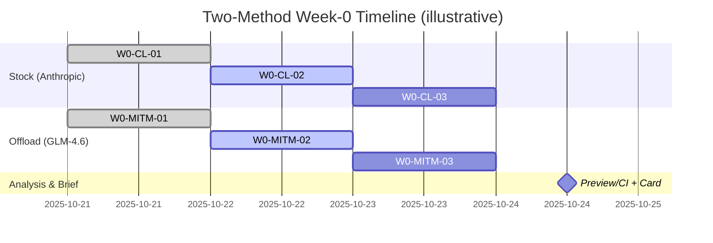

# Offload (Haiku→GLM‑4.6) vs Stock Claude — Field Evaluation Plan

> Purpose: In 2–3 weeks, produce defensible evidence whether Haiku→GLM‑4.6 offload via ClaudeCodeProxy outperforms stock Claude Code on subscription economics at acceptable quality.

---

## Executive Summary

- We run two methodologies across comparable 5‑hour windows:
  1) `stock_anthropic`: Claude Code stock (no proxy), standard operators.
  2) `mitm_offload`: Haiku subagent tasks routed to Z.AI GLM‑4.6; Sonnet orchestration stays on Anthropic.
- Unit of measure: “features delivered per capacity used” with quality gates; we keep append‑only ledgers and JSONL for full auditability.
- Bar of proof: for each methodology, preview reports efficiency + 95% CI with ≥6 windows; router replay and decision card show GO/SOFT GO under guardrails.

```mermaid
flowchart LR
  subgraph Stock (A)
    A1[Claude Code\nAnthropic only]
  end
  subgraph Offload (B)
    B1[Claude Code\nHTTPS_PROXY→mitmdump]
    R((Router\naddon))
  end
  A1 -->|haiku/sonnet| C[Anthropic]
  B1 -->|haiku| R --> Z[Z.AI\nGLM‑4.6]
  B1 -->|sonnet| C
  R -.-> L[(logs/usage.jsonl)]
```

---

## Objectives & Success Criteria

- Primary metric: efficiency = features_delivered / capacity_used (per provider);
  - Codex/Claude capacity from status/usage panes; GLM prompts via ccusage/proxy.
  - Preview prints efficiency and 95% CI per methodology.
- Quality gate: decision card GO/SOFT GO with completeness m/n and anomalies=0.
- Evidence pack: preview, decision_card, window‑audit `--format json`, cost‑compare, ledgers diffs.

---

## Experimental Design

- Windows: target 6–8 per methodology (5‑hour blocks). Minimal quick‑compare: 3 per methodology for an early signal.
- Scheduling: alternate windows by reset where practical (morning/afternoon parity).
- Buffers: respect 10pp weekly headroom; allow explicit exceptions for “limit‑reach” probes (note it in window notes).
- Randomization: vary operator tasks across windows (same capability scope), avoid systematic bias by time‑of‑day.
- Confounds: wait ≥5 min after reset before AFTER capture; avoid mid‑window cross‑pollution.



---

## Tooling & Data Sources

- Tracker (repo: `~/ai/projects/agentos`) for windows/ledgers/CI:
  - Aliases: `os/oe/ox`, `as/ae/ax`, `zs/ze/zx`, `occ` (codex‑ccusage), `acm` (claude‑monitor).
  - CLI: `preview`, `complete`, `churn`, `window-audit --format json`, `decision_card.py`.
- Proxy (repo: `~/git/tools/ClaudeCodeProxy`) for offload runs:
  - `cc mitm start 8082`, `source scripts/sub-env.sh 8082`.
  - Logs: `logs/usage.jsonl` → ingest with `tracker ingest proxy-telemetry --stdin`.
  - Summaries: `scripts/summarize-usage.js`, `scripts/verify-routing.js`.

---

## Runbook — Per Window

```mermaid
sequenceDiagram
  participant Op as Operator
  participant M as Meters (pane)
  participant T as Tracker
  Op->>M: BEFORE reading (after reset)
  M->>T: alias start (as/os)
  Op->>Op: Work (feature tasks)
  Note right of Op: Respect +5 min lag before AFTER
  Op->>M: AFTER reading
  M->>T: alias end (ae/oe)
  Op->>T: complete + churn + window-audit(json)
  Op->>T: decision_card.py; append evidence rows
```

Stock (Anthropic)

1) BEFORE
- `claude /usage | PYTHONPATH=tracker/src python -m tracker.cli --data-dir data/week0/live ingest claude --window W0-CL-1 --stdin`
  or `as --window W0-CL-1`.
2) Work window (planned features).
3) AFTER (≥5‑min buffer)
- `claude /usage | … ingest claude --window W0-CL-1 --stdin` or `ae --window W0-CL-1`.
4) Finalize & Audit
- `python -m tracker.cli --data-dir data/week0/live complete --window W0-CL-1 --claude-features <N> --quality 1.0 --outcome pass --methodology stock_anthropic`
- `python -m tracker.cli --data-dir data/week0/live churn --window W0-CL-1 --provider claude --methodology stock_anthropic --commit-start <shaA> --commit-end <shaB>`
- `python -m tracker.cli --data-dir data/week0/live window-audit --window W0-CL-1 --format json`
- `python scripts/tools/decision_card.py --data-dir data/week0/live --window W0-CL-1`

Offload (Haiku→GLM‑4.6)

1) Start & Env
- `MITM_FILTER_CHAIN=1 MITM_PORT=8082 FORCE_HAIKU_TO_ZAI=1 make mitm`
- `source scripts/sub-env.sh 8082`
2) Work window (Haiku subagent tasks, Sonnet orchestration allowed on Anthropic)
3) Ingest proxy telemetry
- `< logs/usage.jsonl PYTHONPATH=tracker/src python -m tracker.cli --data-dir data/week0/live ingest proxy-telemetry --window W0-MITM-1 --stdin`
4) Finalize & Audit
- `python -m tracker.cli --data-dir data/week0/live complete --window W0-MITM-1 --codex-features <N> --quality 1.0 --outcome pass --methodology mitm_offload`
- `python -m tracker.cli --data-dir data/week0/live churn --window W0-MITM-1 --provider codex --methodology mitm_offload --commit-start <shaA> --commit-end <shaB>`
- `python -m tracker.cli --data-dir data/week0/live window-audit --window W0-MITM-1 --format json`
- `python scripts/tools/decision_card.py --data-dir data/week0/live --window W0-MITM-1`

Multi‑Account (two Claude Pro subs)
- Open two shells and set `AGENT_ID` (isolates alias state to `data/week0/live/state/<id>`):
  - Shell A: `export AGENT_ID=garnin`, windows `W0-CLG-01..`
  - Shell B: `export AGENT_ID=zork`, windows `W0-CLZ-01..`
- Optionally set `TRACKER_DATA_DIR` per shell for hard isolation.

---

## Analysis Plan

- Preview roll‑up: `python -m tracker.cli --data-dir data/week0/live preview` → per‑methodology efficiency + 95% CI.
- Router replay (optional): `scripts/tools/router_replay.py` on Week‑0 data to assert BwK ≥ greedy.
- Cost compare (proxy telemetry): `python scripts/tools/proxy_cost_compare.py --data-dir data/week0/live --min 3` → top rows + totals.
- Decision gate: decision card GO/SOFT GO with completeness line ≥80% and no anomalies.

Interpretation
- Early signal (n=3): directional comparison; continue if separation ≥10–15%.
- Week‑0 (n≥6): CIs stable; choose winner if CI bands don’t overlap materially at the effect size you care about.

---

## Risks & Mitigations

- Lag/rounding → keep +5‑min AFTER buffer (ADR‑004); audit anomalies.
- Duplicate finalizes → `window-audit --format json` to confirm canonical row.
- Header leaks → `cc productize-check` (no Z.AI headers on Anthropic lane).
- H2 jitter/401s → toggles: `MITM_FORCE_H1=1`, `ZAI_HEADER_MODE=authorization`.
- Weekly buffer → stop early to keep ≥10pp unless running explicit “limit” probes.

---

## Deliverables

- Per window: text + JSON window‑audit, decision card output, preview excerpt, evidence ledger rows.
- End of compare: Show‑&‑Ask deck (or MD) with efficiency CIs, cost compare totals, and decision card outcomes.

---

## Checklists

Preflight
- [ ] `PYTHONPATH=tracker/src pytest`
- [ ] `PYTHONPATH=tracker/src behave features`
- [ ] Proxy proves Haiku→Z.AI; Sonnet→Anthropic (if offload)

Per Window
- [ ] BEFORE captured (after reset)
- [ ] Work executed (planned features)
- [ ] AFTER captured (≥5‑min buffer)
- [ ] `complete` + `churn` + `window-audit --format json`
- [ ] Decision card GO/SOFT GO; evidence appended

Week‑0 Done
- [ ] ≥6 windows per methodology; 10pp weekly buffer respected
- [ ] Preview CI shown for both; decision card outcomes logged
- [ ] Cost compare totals printed for offload telemetry

---

## Appendix — Command Matrix

```text
# Stock (Anthropic)
claude /usage | tracker ingest claude --window W0-CL-1 --stdin
tracker complete --window W0-CL-1 --claude-features N --quality 1.0 --outcome pass --methodology stock_anthropic
tracker churn --window W0-CL-1 --provider claude --methodology stock_anthropic --commit-start <A> --commit-end <B>
tracker window-audit --window W0-CL-1 --format json
python scripts/tools/decision_card.py --window W0-CL-1

# Offload (GLM‑4.6)
MITM_FILTER_CHAIN=1 MITM_PORT=8082 FORCE_HAIKU_TO_ZAI=1 make mitm
source scripts/sub-env.sh 8082
< logs/usage.jsonl tracker ingest proxy-telemetry --window W0-MITM-1 --stdin
tracker complete --window W0-MITM-1 --codex-features N --quality 1.0 --outcome pass --methodology mitm_offload
tracker churn --window W0-MITM-1 --provider codex --methodology mitm_offload --commit-start <A> --commit-end <B>
tracker window-audit --window W0-MITM-1 --format json
python scripts/tools/decision_card.py --window W0-MITM-1
```

