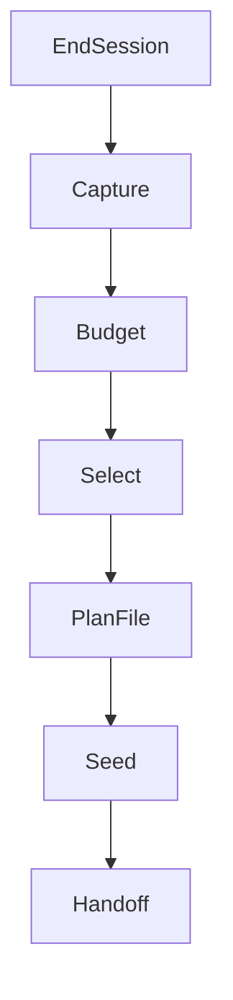

# SOP — Next‑Session Planning (Token‑Budgeted, Spec‑First)

Purpose
- Ensure every session ends with a concrete, autonomous plan for the next session, sized to 70–80% of the Codex context window (≈190–218K tokens on 272K), with spec‑first work items and clear ingestion/validation steps.

When
- Run at the end of every session (after validations and handoff updates).

Inputs
- Latest `/status` pane (Codex) and any ccusage snapshots.
- `progress.md` and `docs/SESSION_HANDOFF.md` entries from the current session.
- Backlog: `docs/Tasks/tracker_cli_todo.md` (Task ↔ Spec table), `docs/Tasks/archive_curation.md`, `docs/Tasks/ccusage_codex_coverage.md`, and active plans under `plans/`.
- PRD/SOP refs: `docs/SOP/PRD_v1.6-final.md`, `docs/SOP/week0_final_protocol.md`, `docs/SOP/standard-operating-procedures.md`.

Checklist
1) Capture Current State
- Record Codex `/status` in progress (context %, 5h %, weekly %)
- Note which features/scenarios shipped (update `docs/Tasks/tracker_feature_log.md`)

2) Define Target Budget
- Set next window target to 70–80% of 272K (190–218K tokens)
- Allocate budget per task bucket (specs, fixtures, code, tests, docs), leaving 10–20K buffer
- Append a planning row to `docs/Ledgers/Token_Churn_Ledger.csv` noting the next session’s token budget (leave `tokens_actual`/`delta` blank until the session ends).

3) Select Tasks From Backlog (Spec‑First)
- Prefer tasks with clear BDD coverage gaps or automation value (ccusage, Codex `/status` script)
- For each task, draft or point to a `.feature` stub before implementation
- Cross‑link any large docs that require progressive summaries

4) Produce Next‑Session Plan (single file)
- Add or update `plans/<YYYY‑MM‑DD>_next_session.plan.md` with:
  - Required reading list (paths + rationale)
  - Tasks, each with token budget, start/end criteria, and expected artefacts
  - Validation matrix (targeted pytest/behave, aliases to run, preview checks)
  - Handoff requirements (files to update)

5) Seed Materials
- Create empty feature files/step stubs as needed
- Create fixture placeholders (tests/fixtures/…)
- Provide any shell scaffolds (scripts/automation/…)

6) Validation & Handoff
- Ensure `AGENTS.md` Glossary aligns with planned folders
- Append the plan pointer to `progress.md` and `docs/SESSION_HANDOFF.md`

Simple Flow

Example Materials
- Sample planning note copied to `docs/System/samples/est1_sample.md` for reference (operator style, formatting, and priorities). Use this as a tone/structure guide when writing the next plan.

Acceptance Criteria
- A dated next‑session plan exists under `plans/` with token budgets and spec‑first tasks
- Task ↔ Spec table updated in `docs/Tasks/tracker_cli_todo.md`
- Feature stubs/fixtures are in place
- Handoff references added

Notes
- Keep docs flat: prefer updating existing folders; avoid deep nesting. Progressive summaries are a workflow technique—cite line references using `path:line` where applicable.
- Token planning/retro process is summarized in `docs/System/token_tracking.md` (planned vs actual vs snapshot), capturing mid-session updates and final delta so we can spot trends and improve estimates.
