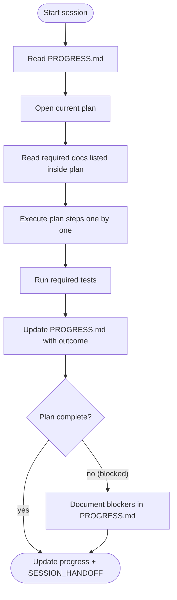
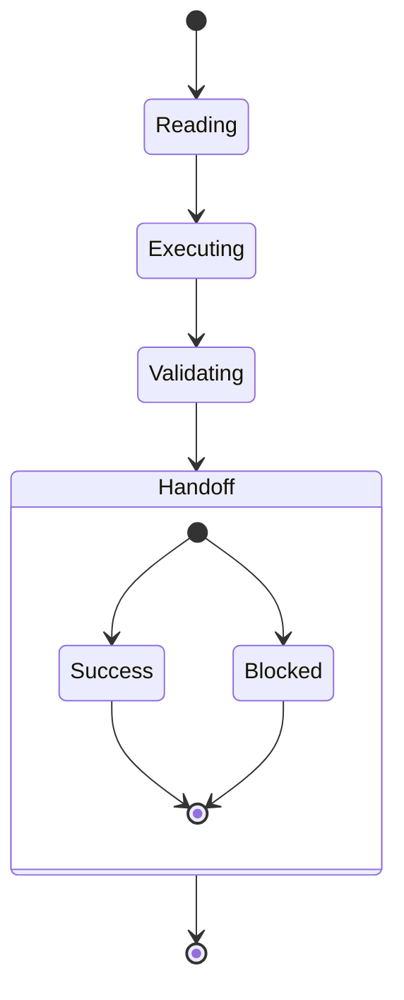

# Plan Execution SOP

> This SOP is the only process guide. Every agent reads it in full before touching a plan.

## Cycle Rules
1. **One plan per agent.** Do not read or modify future plans—`PROGRESS.md` points to the only plan you may open.
2. **Read the CE_MAGIC prompts and SOPs for your role before touching the plan.** Use `docs/System/context-engineering.md` to confirm whether you are Scout, Planner, or Executor.
3. **Follow the plan exactly.** No skimming, no partial execution. Use the commands as written.
4. **Keep the workspace clean.** If you need a scratch file, delete it before finishing.
5. **Validation is mandatory.** Run every test/build command listed in the plan before updating `PROGRESS.md`.
6. **Handoff requires both `PROGRESS.md` updates and a concise entry in `docs/SESSION_HANDOFF.md`.** Log tests, blockers, and artifact links there.
7. **No side edits.** If you notice unrelated issues, log them elsewhere; do not fix them inside the current plan.

## Role Selection & Required Prompts
1. Read `PROGRESS.md` to confirm the active plan and identify the expected role. If uncertain, stop and clarify.
2. Consult `docs/System/context-engineering.md` and read the CE_MAGIC prompt set for your role:
   - **Scout:** `/Users/m/ai/projects/agentos/docs/System/CE_MAGIC_PROMPTS/SIMPLE-INSTRUCTIONS.md` + `/Users/m/ai/projects/agentos/docs/System/CE_MAGIC_PROMPTS/RESEARCH-FOLLOWING-MAGIC-PROMPT.md`
   - **Planner:** `/Users/m/ai/projects/agentos/docs/System/CE_MAGIC_PROMPTS/SIMPLE-INSTRUCTIONS.md` + `/Users/m/ai/projects/agentos/docs/System/CE_MAGIC_PROMPTS/PLAN-USING-MAGIC-PROMPT.md`
   - **Executor:** `/Users/m/ai/projects/agentos/docs/System/CE_MAGIC_PROMPTS/SIMPLE-INSTRUCTIONS.md` + `/Users/m/ai/projects/agentos/docs/System/CE_MAGIC_PROMPTS/EXECUTE-WITH-MAGIC-PROMPT.md`
3. Read the SOP linked to that role (Exploration/Planning in `docs/SOP/code-change-plan-sop.md`, Execution here) before continuing to the plan’s Required Reading list.
4. Open every item in the plan’s Required Reading list, including any `ai-docs/…` references (knowledge base, RESEARCH_BRIEF, QUESTIONS, playground examples) so the context is fresh before you act.
5. Execute only the steps assigned to your role; leave remaining phases for the next agent.

### Scout Responsibilities – AI Workspace First
Before reading production code, Scouts must:
- Complete every AI-doc reading called out in the active task file (typically `ai-docs/README.md`, `MANIFEST.md`, `RESEARCH_BRIEF.md`, `QUESTIONS.md`, relevant `wrappers-draft/` files, and playground demos).
- Record file:line citations for each AI-doc asset in the discovery notes under an **AI-Docs References** heading.
- Log missing or outdated AI-doc materials so planners can flag follow-ups.
Discovery handoffs without AI-doc citations are invalid—Scouts must redo discovery if citations are absent.

### Planner Responsibilities – Verify AI Coverage
Planners must confirm the Scout’s discovery notes include the required AI-doc citations before drafting a plan. If citations are missing or incomplete, stop and send the Scout back for rework. Plans should cite the same AI-doc references (file:line) when reusing patterns from the workspace.

## Git Flow Handoff
- After completing every step in the plan and passing validations, run `git status` to confirm only the expected changes are present.
- Stage the changes with `git add` (targeted stages are fine; avoid blanket `git add .` if noise is present).
- Commit the work with a message that references the plan identifier (e.g. `Plan 04: add accessibility helpers`).
- Leave the working tree clean before you finish the handoff updates in `PROGRESS.md` or start another plan.

## Naming & Archival Rules
- Active plans live in `plans/` with numeric prefixes (`01_...md`).
- Only the currently active plan remains outside `docs/Archive/Plans/`; completed PRDs and plans move to the archive with numbered filenames.
- **Never delete plan files.** When a plan is superseded or executed, move it into the appropriate archive folder (`docs/Archive/Plans/executed/` or `docs/Archive/Plans/wrong-drafts/`) instead of running `rm`.
- Repository root contains just: code, current plans, SOP, PROGRESS.md, and required wrappers/schemas.
- When you finish a plan, archive any superseded docs immediately after updating `PROGRESS.md` and `docs/SESSION_HANDOFF.md`.

