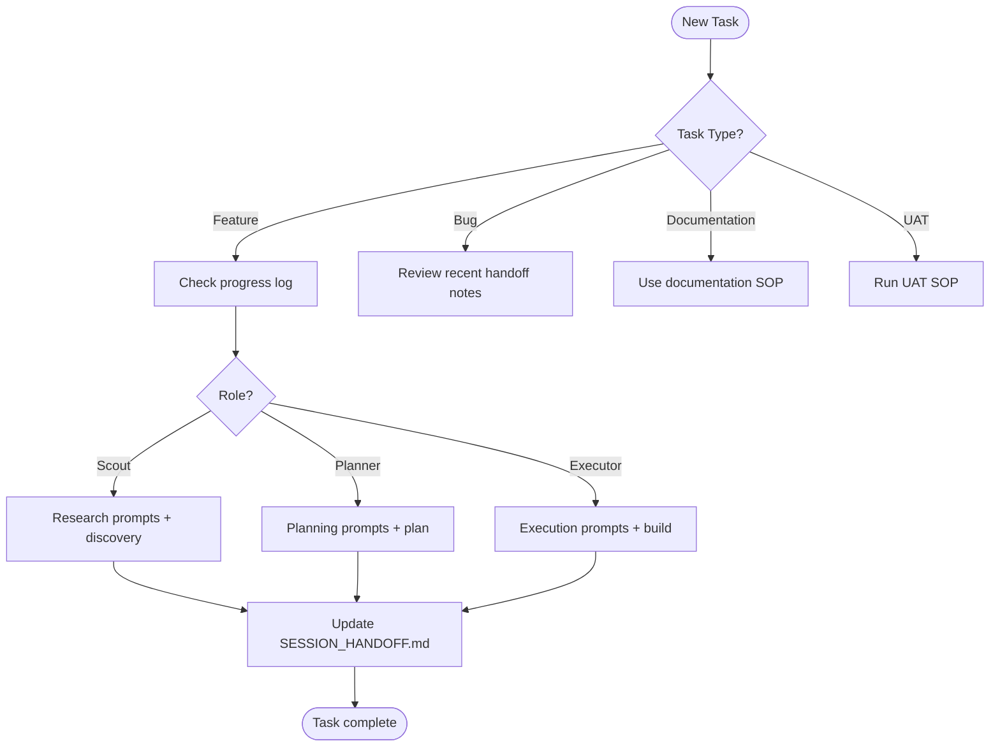

# START HERE – Roles & Flow

> Follow directory governance rules; do not add new top-level folders under `docs/` without an approved plan.

## Decision Tree

## Quick Links
- `progress.md`
- `docs/SESSION_HANDOFF.md`
- `docs/System/context-engineering.md`
- `docs/SOP/plan-execution-sop.md`
- `docs/System/documentation-index.md`
