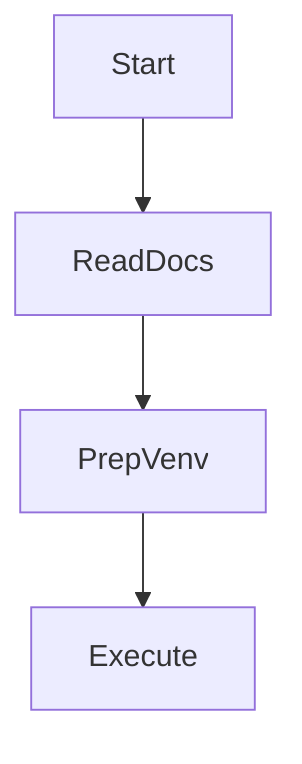
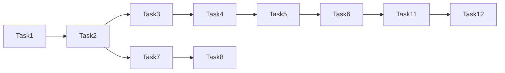

# Autonomous Long Session Plan (Draft 2025-10-19)

**Goal:** prepare the next agent to run a multi-hour Codex/Claude session without human prompts—spec-first, fully logged, and automation-friendly.

## Pre-flight Checklist
1. Read `progress.md:2025-10-19` and `docs/SESSION_HANDOFF.md:2025-11-06`.
2. Review `docs/Tasks/tracker_cli_todo.md` (especially the Task ↔ Spec mapping).
3. Read methodologies index + Experiment 001 log:
   - `docs/System/methodologies/README.md`
   - `docs/System/methodologies/tracker_alias_cycle/experiments/001_provider_windows.md`
4. Skim Codex/Claude references:
   - `docs/ai-docs/codex/codex_cli_reference.md`
   - `docs/ai-docs/claude-monitor-reference.md`

## Task Roadmap (execute in order)
| # | Task | Output | Spec / Doc |
|---| --- | --- | --- |
| 1 | Draft automation BDD stub | `features/tracker_automation.feature` skeleton | new file (add to repo) |
| 2 | Prototype Codex `/status` script | Shell script + log path | `docs/Tasks/codex_status_automation.md` |
| 3 | Integrate automation into tracker alias flow | CLI hook or instructions | same as #2 |
| 4 | Capture real Codex window (Experiment 001) | Window log + tracker ingestion | `experiments/001_provider_windows.md` |
| 5 | Capture Claude window (Experiment 001) | Window log + `acm` ingestion | same |
| 6 | Update feature log after each window | Rows in `docs/Tasks/tracker_feature_log.md` | existing doc |
| 7 | Migrate archive research (churn/tools) | Summaries in `docs/Archive/` | `docs/Tasks/archive_curation.md` |
| 8 | Cross-link methodologies with curated notes | Updated metrics/experiments files | methodology folders |
| 9 | Add FAQ / troubleshooting for automation | Section in this plan + `docs/Tasks/codex_status_automation.md` | this doc |
| 10 | Update `tracker_cli_todo.md` statuses | Checked boxes + new subtasks | existing todo |
| 11 | Run validation suite | `pytest` + `behave features` logs | `progress.md` |
| 12 | Record session handoff | Handoff entry + experiment metrics | `docs/SESSION_HANDOFF.md` |

## Execution Notes
- Always start coding by extending/drafting a `.feature` file; no implementation until the stub exists (Task #1).
- Automation scripts should pipe captured output directly into aliases (`occ`, `os`, `acm`) and archive the raw pane in `data/week0/live/automation/` (create directory if missing).
- After each major step, append to `progress.md` with commands run and artefacts touched.
- Use `docs/Tasks/tracker_feature_log.md` to track new scenarios—include timestamp, files, and tests run.

## FAQ (for next agent)
**Q: How do I ensure aliases are available?**
A: `source scripts/tracker-aliases.sh` after activating the venv; run `type os` to confirm.

**Q: Automation script fails because no session exists. What now?**
A: Re-run `codex exec "hi"` in the automation workspace to seed a session, then rerun the script.

**Q: Claude monitor output doesn’t include percentages.**
A: Ensure `claude-monitor --view realtime` is running; if idle banner persists, log the issue in `progress.md` and fall back to manual `/usage` capture.

**Q: Where do I put curated archive summaries?**
A: Create files under `docs/Archive/` matching topic names (e.g., `churn-research.md`) and reference them from methodologies/SOP.

**Q: Which tests must run before handoff?**
A: `cd tracker && . .venv/bin/activate && pytest`, then `behave features`. Log outputs in `progress.md` and `docs/SESSION_HANDOFF.md`.

## Next Actions (before next session)
- [ ] Create `features/tracker_automation.feature` stub referencing automation workflow.
- [ ] Prepare shell script scaffold in `scripts/automation/codex_status.sh` (pending implementation).
- [ ] Move priority archive docs into `docs/Archive/` (start with churn/tooling notes).

### Add-on: ccusage-codex Weekly Ritual
- Read `docs/Tasks/ccusage_codex_coverage.md` before automation work.
- Capture daily/weekly JSON via `ccusage-codex` commands and ingest using new BDD scenarios (`features/tracker_ccusage.feature`).
- Correlate totals with Codex windows recorded in Experiment 001 log.
