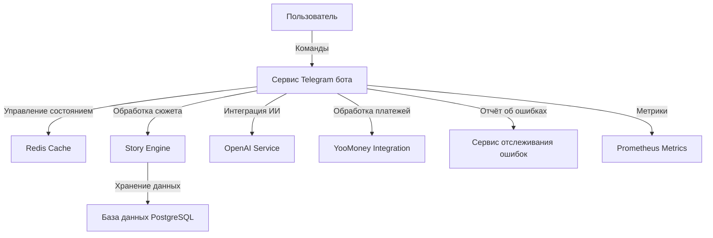

# Технические спецификации

## 1. Ядро архитектуры

### 1.1 Компоненты системы



### 1.2 Детали компонентов

#### Story Engine

```python
class StoryEngine:
    def __init__(self, db_connection: Database, cache_client: CacheManager):
        """Initialize the Story Engine with database and cache connections.

        Args:
            db_connection (Database): Database connection manager.
            cache_client (CacheManager): Cache management system.
        """
        self.db = db_connection
        self.cache = cache_client
        self.state_manager = StateManager()
        self.content_generator = ContentGenerator()

    async def process_user_input(self, user_id: int, input_text: str) -> StoryResponse:
        try:
            # Load user state
            state = await self.state_manager.get_user_state(user_id)

            # Process input based on current state
            response = await self._process_state_input(state, input_text)

            # Update user state
            await self.state_manager.update_user_state(user_id, state)

            return response
        except Exception as e:
            await self.error_tracker.log_error(e, {
                'user_id': user_id,
                'input': input_text,
                'state': state
            })
            return StoryResponse(
                type='error',
                message='An error occurred processing your input'
            )
```

#### Управление состоянием

```python
class StateManager:
    def __init__(self, redis_client):
        self.redis = redis_client
        self.state_ttl = 3600  # 1 hour

    async def get_user_state(self, user_id: int) -> UserState:
        state_data = await self.redis.get(f"user_state:{user_id}")
        if not state_data:
            return await self._load_state_from_db(user_id)
        return UserState.from_json(state_data)

    async def update_user_state(self, user_id: int, state: UserState):
        # Update cache
        await self.redis.setex(
            f"user_state:{user_id}",
            self.state_ttl,
            state.to_json()
        )

        # Persist to database
        await self._persist_state_to_db(user_id, state)
```

#### Обработка ошибок

```python
class ErrorHandler:
    def __init__(self):
        self.error_tracker = ErrorTracker()
        self.recovery_strategies = {
            ConnectionError: self._handle_connection_error,
            StateError: self._handle_state_error,
            AIError: self._handle_ai_error,
            PaymentError: self._handle_payment_error
        }

    async def handle_error(self, error: Exception, context: dict) -> Response:
        # Log error
        await self.error_tracker.log_error(error, context)

        # Get recovery strategy
        strategy = self.recovery_strategies.get(
            type(error),
            self._handle_unknown_error
        )

        # Execute recovery
        return await strategy(error, context)
```

### 1.3 Конкретная реализация для Telegram

```python
class TelegramBotHandler:
    def __init__(self, token: str):
        self.bot = Bot(token=token)
        self.dispatcher = Dispatcher(self.bot)
        self.story_engine = StoryEngine()

    async def setup_handlers(self):
        self.dispatcher.add_handler(
            CommandHandler("start", self.start_command)
        )
        self.dispatcher.add_handler(
            CommandHandler("help", self.help_command)
        )
        # Add additional command handlers as needed

    async def start_command(self, update, context):
        # Implementation for /start command
        pass

    async def help_command(self, update, context):
        # Implementation for /help command
        pass
```

### 1.4 Дополнительные компоненты

```python
class MultimediaHandler:
    def __init__(self, storage_client):
        self.storage = storage_client
        self.allowed_types = ['image', 'audio', 'video']

    async def process_media(self, file_id: str, media_type: str) -> MediaResponse:
        # Validate media type
        if media_type not in self.allowed_types:
            raise ValueError("Unsupported media type")
        # Process media upload and delivery
        # (Implementation details here)
        return MediaResponse(status="success", file_id=file_id)

class SupportHoursMonitor:
    def __init__(self):
        from datetime import time
        self.support_hours = {
            'start': time(10, 0),  # 10:00 MSK
            'end': time(20, 0)     # 20:00 MSK
        }
```

## 2. Управление данными

### 2.1 Схема базы данных

```sql
-- Users table
CREATE TABLE users (
    id BIGSERIAL PRIMARY KEY,
    telegram_id BIGINT UNIQUE NOT NULL,
    username TEXT,
    created_at TIMESTAMP WITH TIME ZONE DEFAULT CURRENT_TIMESTAMP,
    subscription_tier TEXT DEFAULT 'free',
    subscription_expires_at TIMESTAMP WITH TIME ZONE
);

-- Story progress
CREATE TABLE story_progress (
    id BIGSERIAL PRIMARY KEY,
    user_id BIGINT REFERENCES users(id),
    story_id TEXT NOT NULL,
    current_node TEXT NOT NULL,
    state JSONB NOT NULL,
    updated_at TIMESTAMP WITH TIME ZONE DEFAULT CURRENT_TIMESTAMP,
    UNIQUE (user_id, story_id)
);

-- Story nodes
CREATE TABLE story_nodes (
    id TEXT PRIMARY KEY,
    story_id TEXT NOT NULL,
    content JSONB NOT NULL,
    transitions JSONB NOT NULL,
    metadata JSONB
);

-- Interaction history
CREATE TABLE interaction_history (
    id BIGSERIAL PRIMARY KEY,
    user_id BIGINT REFERENCES users(id),
    story_id TEXT NOT NULL,
    node_id TEXT NOT NULL,
    interaction_type TEXT NOT NULL,
    interaction_data JSONB NOT NULL,
    created_at TIMESTAMP WITH TIME ZONE DEFAULT CURRENT_TIMESTAMP
);

-- Story content schema for interactive stories
CREATE TABLE story_content (
    id TEXT PRIMARY KEY,
    story_id TEXT NOT NULL,
    scene_content TEXT NOT NULL,
    multimedia_refs JSONB,
    choices JSONB
);

-- Create indexes
CREATE INDEX idx_story_progress_user ON story_progress(user_id);
CREATE INDEX idx_interaction_history_user_story ON interaction_history(user_id, story_id);
CREATE INDEX idx_story_nodes_story ON story_nodes(story_id);
```

### 2.2 Стратегия кэширования

```python
class CacheManager:
    def __init__(self, redis_client):
        self.redis = redis_client
        self.cache_ttls = {
            'story_node': 3600,  # 1 hour
            'user_state': 3600,
            'ai_response': 1800  # 30 minutes
        }

    async def get_cached_data(self, key: str, category: str) -> Optional[dict]:
        cache_key = f"{category}:{key}"
        data = await self.redis.get(cache_key)
        return json.loads(data) if data else None

    async def cache_data(self, key: str, category: str, data: dict):
        cache_key = f"{category}:{key}"
        await self.redis.setex(
            cache_key,
            self.cache_ttls[category],
            json.dumps(data)
        )
```

## 3. Реализация безопасности

### 3.1 Валидация запросов

```python
class RequestValidator:
    def __init__(self, config: SecurityConfig):
        self.config = config
        self.rate_limiter = RateLimiter(config.rate_limit)

    async def validate_request(self, request: Request) -> bool:
        # Check rate limits
        if not await self.rate_limiter.check_limit(request):
            raise RateLimitExceeded()

        # Validate request signature
        if not self._validate_signature(request):
            raise InvalidSignature()

        # Check user permissions
        if not await self._check_permissions(request):
            raise PermissionDenied()

        return True

    def _validate_signature(self, request: Request) -> bool:
        expected = request.headers.get('X-Signature')
        if not expected:
            return False

        computed = self._compute_signature(request)
        return hmac.compare_digest(expected, computed)
```

### 3.2 Защита данных

```python
class DataProtector:
    def __init__(self, encryption_key: str):
        self.fernet = Fernet(encryption_key)
        self.sensitive_fields = {
            'payment_info',
            'personal_data'
        }

    def encrypt_sensitive_data(self, data: dict) -> dict:
        encrypted = data.copy()
        for field in self.sensitive_fields:
            if field in encrypted:
                encrypted[field] = self._encrypt_field(encrypted[field])
        return encrypted

    def _encrypt_field(self, value: Any) -> str:
        serialized = json.dumps(value)
        return self.fernet.encrypt(serialized.encode()).decode()
```

## 4. Интеграция OpenAI

### 4.1 Генерация контента

```python
class ContentGenerator:
    def __init__(self, api_key: str, cache_manager: CacheManager):
        self.client = OpenAI(api_key=api_key)
        self.cache = cache_manager

    async def generate_response(
        self,
        context: str,
        prompt: str,
        style: str
    ) -> str:
        # Check cache
        cache_key = self._get_cache_key(context, prompt, style)
        cached = await self.cache.get_cached_data(cache_key, 'ai_response')
        if cached:
            return cached['response']

        # Generate response
        response = await self._call_openai(context, prompt, style)

        # Cache response
        await self.cache.cache_data(
            cache_key,
            'ai_response',
            {'response': response}
        )

        return response

    async def _call_openai(
        self,
        context: str,
        prompt: str,
        style: str
    ) -> str:
        try:
            completion = await self.client.chat.completions.create(
                model="gpt-4",
                messages=[
                    {"role": "system", "content": style},
                    {"role": "user", "content": f"Context: {context}\n\nPrompt: {prompt}"}
                ],
                temperature=0.7,
                max_tokens=500
            )
            return completion.choices[0].message.content
        except Exception as e:
            raise AIError(f"OpenAI API error: {str(e)}")
```

## 5. Интеграция платежей

### 5.1 YooMoney

```python
class PaymentProcessor:
    def __init__(self, api_key: str):
        self.client = YooMoneyClient(api_key)

    async def create_payment(
        self,
        user_id: int,
        amount: Decimal,
        description: str
    ) -> PaymentResponse:
        try:
            payment = await self.client.create_payment({
                'amount': {
                    'value': str(amount),
                    'currency': 'RUB'
                },
                'capture': True,
                'description': description,
                'metadata': {
                    'user_id': user_id
                }
            })

            return PaymentResponse(
                id=payment.id,
                status=payment.status,
                confirmation_url=payment.confirmation.confirmation_url
            )
        except Exception as e:
            raise PaymentError(f"Payment creation failed: {str(e)}")
```

### 5.2 Управление подписками

```python
class SubscriptionManager:
    def __init__(self, db_connection):
        self.db = db_connection
        self.plans = {
            'free': {
                'price': 0,
                'features': ['basic_stories']
            },
            'premium': {
                'price': 500,
                'features': [
                    'basic_stories',
                    'premium_stories',
                    'advanced_tools'
                ]
            }
        }

    async def process_subscription(
        self,
        user_id: int,
        plan: str,
        payment_id: str
    ):
        async with self.db.transaction():
            # Verify payment
            payment = await self._verify_payment(payment_id)
            if not payment.is_successful:
                raise PaymentError("Payment verification failed")

            # Update user subscription
            await self._update_subscription(user_id, plan)

            # Log transaction
            await self._log_transaction(user_id, plan, payment_id)
```

## 6. Мониторинг производительности

### 6.1 Сбор метрик

```python
class MetricsCollector:
    def __init__(self):
        self.metrics = {
            'request_duration': Counter(
                'request_duration_seconds',
                'Request duration in seconds',
                ['endpoint']
            ),
            'error_count': Counter(
                'error_count_total',
                'Total number of errors',
                ['type']
            ),
            'active_users': Gauge(
                'active_users',
                'Number of active users'
            )
        }

    async def record_request_duration(
        self,
        endpoint: str,
        duration: float
    ):
        self.metrics['request_duration'].labels(endpoint).inc(duration)

    async def record_error(self, error_type: str):
        self.metrics['error_count'].labels(error_type).inc()
```

### 6.2 Оптимизация производительности

```python
class PerformanceOptimizer:
    def __init__(self, cache_manager: CacheManager):
        self.cache = cache_manager

    async def optimize_response(
        self,
        user_id: int,
        story_id: str
    ) -> dict:
        # Load frequently accessed data
        cached_data = await self._load_cached_data(user_id, story_id)
        if cached_data:
            return cached_data

        # Generate response
        response = await self._generate_response(user_id, story_id)

        # Cache for future requests
        await self._cache_response(user_id, story_id, response)

        return response
```

## 7. Стратегия тестирования

### 7.1 Модульные тесты

```python
class TestStoryEngine:
    async def test_process_user_input(self):
        # Setup
        engine = StoryEngine(MockDB(), MockCache())
        user_id = 123
        input_text = "examine the book"

        # Execute
        response = await engine.process_user_input(user_id, input_text)

        # Assert
        assert response.type == 'story'
        assert 'book' in response.content.lower()

    async def test_error_handling(self):
        # Setup
        engine = StoryEngine(MockDB(), MockCache())
        user_id = 123
        input_text = "invalid command"

        # Execute
        response = await engine.process_user_input(user_id, input_text)

        # Assert
        assert response.type == 'error'
        assert 'error occurred' in response.message.lower()
```

### 7.2 Интеграционные тесты

```python
class TestIntegration:
    def setup_class(self):
        self.db = TestDatabase()
        self.cache = TestRedis()
        self.engine = StoryEngine(self.db, self.cache)
        self.payment_processor = PaymentProcessor(test_api_key)

    async def test_story_flow(self):
        # Test complete user story flow
        user_id = await self.create_test_user()

        # Start story
        response = await self.engine.start_story(user_id, "test_story")
        assert response.type == "story_start"

        # Process choices
        choices = ["examine room", "talk to witness", "collect evidence"]
        for choice in choices:
            response = await self.engine.process_user_input(user_id, choice)
            assert response.type in ["story", "choice", "dialogue"]

        # Verify state persistence
        state = await self.engine.state_manager.get_user_state(user_id)
        assert state.story_progress["test_story"]["visited_nodes"] >= len(choices)

    async def test_payment_flow(self):
        user_id = await self.create_test_user()

        # Initialize payment
        payment = await self.payment_processor.create_payment(
            user_id=user_id,
            amount=Decimal("500.00"),
            description="Premium Subscription"
        )
        assert payment.status == "pending"

        # Simulate payment completion
        await self.payment_processor.process_webhook({
            "payment_id": payment.id,
            "status": "succeeded"
        })

        # Verify subscription update
        user = await self.db.get_user(user_id)
        assert user.subscription_tier == "premium"

    async def test_multimedia_handling(self):
        # Test media upload and delivery
        multimedia_handler = MultimediaHandler(TestStorageClient())
        response = await multimedia_handler.process_media(file_id="test123", media_type="image")
        assert response.status == "success"
```

### 7.3 Тестирование производительности

```python
class TestPerformance:
    async def test_response_time(self):
        engine = StoryEngine(TestDB(), TestCache())

        async def measure_response_time():
            start = time.time()
            await engine.process_user_input(123, "examine the book")
            return time.time() - start

        # Run multiple iterations
        response_times = [await measure_response_time() for _ in range(100)]

        # Analyze results
        avg_time = statistics.mean(response_times)
        p95_time = statistics.quantile(response_times, 0.95)

        assert avg_time < 0.2  # 200ms average
        assert p95_time < 0.5  # 500ms 95th percentile

    async def test_concurrent_users(self):
        engine = StoryEngine(TestDB(), TestCache())

        async def simulate_user(user_id):
            for _ in range(10):
                response = await engine.process_user_input(user_id, "random action")
                assert response.type != "error"
                await asyncio.sleep(random.uniform(0.1, 0.5))

        # Simulate 100 concurrent users
        users = [simulate_user(i) for i in range(100)]
        await asyncio.gather(*users)
```

## 8. Архитектура развертывания

### 8.1 Балансировка нагрузки

```python
class LoadBalancer:
    def __init__(self, config: LoadBalancerConfig):
        self.config = config
        self.health_checker = HealthChecker()
        self.metrics_collector = MetricsCollector()

    async def route_request(self, request: Request) -> Response:
        # Select optimal server based on health and load
        server = await self._select_server()

        try:
            # Forward request with retry logic
            for attempt in range(self.config.max_retries):
                try:
                    return await self._forward_request(server, request)
                except TemporaryError as e:
                    if attempt == self.config.max_retries - 1:
                        raise
                    await asyncio.sleep(self.config.retry_delay)
                    server = await self._select_server()  # Get new server for retry
        finally:
            # Update metrics
            await self.metrics_collector.record_request(server, request)

    async def _select_server(self) -> Server:
        # Get healthy servers
        healthy_servers = await self.health_checker.get_healthy_servers()

        # Calculate server loads
        server_loads = await self._calculate_server_loads(healthy_servers)

        # Select server with lowest load
        return min(server_loads.items(), key=lambda x: x[1])[0]
```

### 8.2 CDN (Сеть доставки контента)

```python
class CDNManager:
    def __init__(self, config: CDNConfig):
        self.config = config
        self.cache_manager = CacheManager()

    async def get_content(self, content_id: str) -> Content:
        # Try to get content from CDN
        cdn_content = await self._get_from_cdn(content_id)
        if cdn_content:
            return cdn_content

        # If not in CDN, get from origin
        origin_content = await self._get_from_origin(content_id)

        # Cache in CDN for future requests
        await self._cache_in_cdn(content_id, origin_content)

        return origin_content

    async def invalidate_content(self, content_id: str):
        # Remove content from CDN cache
        await self._remove_from_cdn(content_id)

        # Notify all edge locations
        await self._notify_edge_locations(content_id)
```

## 9. Аварийное восстановление

### 9.1 Стратегия резервного копирования

```python
class BackupManager:
    def __init__(self, config: BackupConfig):
        self.config = config
        self.storage_manager = StorageManager()

    async def create_backup(self) -> BackupMetadata:
        # Create consistent snapshot
        snapshot = await self._create_snapshot()

        # Compress backup
        compressed = await self._compress_backup(snapshot)

        # Upload to backup storage
        metadata = await self._upload_backup(compressed)

        # Verify backup integrity
        await self._verify_backup(metadata)

        return metadata

    async def restore_from_backup(self, backup_id: str):
        # Download backup
        backup_data = await self._download_backup(backup_id)

        # Verify integrity
        await self._verify_backup_integrity(backup_data)

        # Restore data
        await self._restore_data(backup_data)

        # Verify restoration
        await self._verify_restoration()
```

### 9.2 Обработка сбоев (failover)

```python
class FailoverManager:
    def __init__(self, config: FailoverConfig):
        self.config = config
        self.health_checker = HealthChecker()

    async def handle_failover(self, failed_component: str):
        # Log failover event
        await self._log_failover_start(failed_component)

        try:
            # Switch to backup component
            await self._activate_backup(failed_component)

            # Verify backup is working
            await self._verify_backup_health(failed_component)

            # Update routing configuration
            await self._update_routing(failed_component)

            # Notify monitoring systems
            await self._notify_monitoring(failed_component)

        except Exception as e:
            # Handle failover failure
            await self._handle_failover_failure(failed_component, e)

        finally:
            # Log failover completion
            await self._log_failover_complete(failed_component)
```

## 10. Мониторинг и оповещение

### 10.1 Настройка оповещений

```python
class AlertManager:
    def __init__(self, config: AlertConfig):
        self.config = config
        self.notification_manager = NotificationManager()

    async def configure_alerts(self):
        await self._configure_system_alerts()
        await self._configure_business_alerts()
        await self._configure_security_alerts()

    async def _configure_system_alerts(self):
        # Configure system health alerts
        self.prometheus.AlertRule(
            name="high_error_rate",
            expr='rate(error_count_total[5m]) > 0.1',
            for_="5m",
            labels={"severity": "critical"},
            annotations={
                "summary": "High error rate detected",
                "description": "Error rate exceeds 10% over 5 minutes"
            }
        )

        # Configure resource usage alerts
        self.prometheus.AlertRule(
            name="high_memory_usage",
            expr='memory_usage_bytes > 90 * 1024 * 1024 * 1024',
            for_="10m",
            labels={"severity": "warning"},
            annotations={
                "summary": "High memory usage detected",
                "description": "Memory usage exceeds 90GB for 10 minutes"
            }
        )
```

### 10.2 Проверка здоровья (Health Checks)

```python
class HealthChecker:
    def __init__(self, config: HealthConfig):
        self.config = config
        self.metrics_collector = MetricsCollector()

    async def check_system_health(self) -> SystemHealth:
        # Check component health
        db_health = await self._check_database()
        cache_health = await self._check_cache()
        api_health = await self._check_apis()

        # Check system metrics
        system_metrics = await self._collect_system_metrics()

        # Generate health report
        health_report = SystemHealth(
            database=db_health,
            cache=cache_health,
            apis=api_health,
            metrics=system_metrics,
            timestamp=datetime.utcnow()
        )

        # Update health status
        await self._update_health_status(health_report)

        return health_report
```

## 11. Дополнительные улучшения в безопасности

### 11.1 Управление токенами

```python
class TokenManager:
    def __init__(self, config: TokenConfig):
        self.config = config
        self.key_manager = KeyManager()

    async def generate_token(self, user_id: int, scope: List[str]) -> Token:
        # Generate token
        token = await self._create_token(user_id, scope)

        # Store token metadata
        await self._store_token_metadata(token)

        # Set token expiration
        await self._set_token_expiration(token)

        return token

    async def validate_token(self, token: str) -> TokenValidation:
        # Verify token signature
        signature_valid = await self._verify_signature(token)

        # Check token expiration
        expiration_valid = await self._check_expiration(token)

        # Verify token scope
        scope_valid = await self._verify_scope(token)

        return TokenValidation(
            valid=all([signature_valid, expiration_valid, scope_valid]),
            reason=self._get_validation_reason([
                signature_valid, expiration_valid, scope_valid
            ])
        )
```

### 11.2 Ограничение скорости (Rate Limiting)

```python
class RateLimiter:
    def __init__(self, config: RateLimitConfig):
        self.config = config
        self.cache = CacheManager()

    async def check_limit(self, identifier: str) -> RateLimitCheck:
        # Get current request count
        current_count = await self._get_request_count(identifier)

        # Check if limit exceeded
        if current_count >= self.config.max_requests:
            return RateLimitCheck(
                allowed=False,
                remaining=0,
                reset_time=await self._get_reset_time(identifier)
            )

        # Increment request count
        await self._increment_request_count(identifier)

        return RateLimitCheck(
            allowed=True,
            remaining=self.config.max_requests - current_count - 1,
            reset_time=await self._get_reset_time(identifier)
        )
```