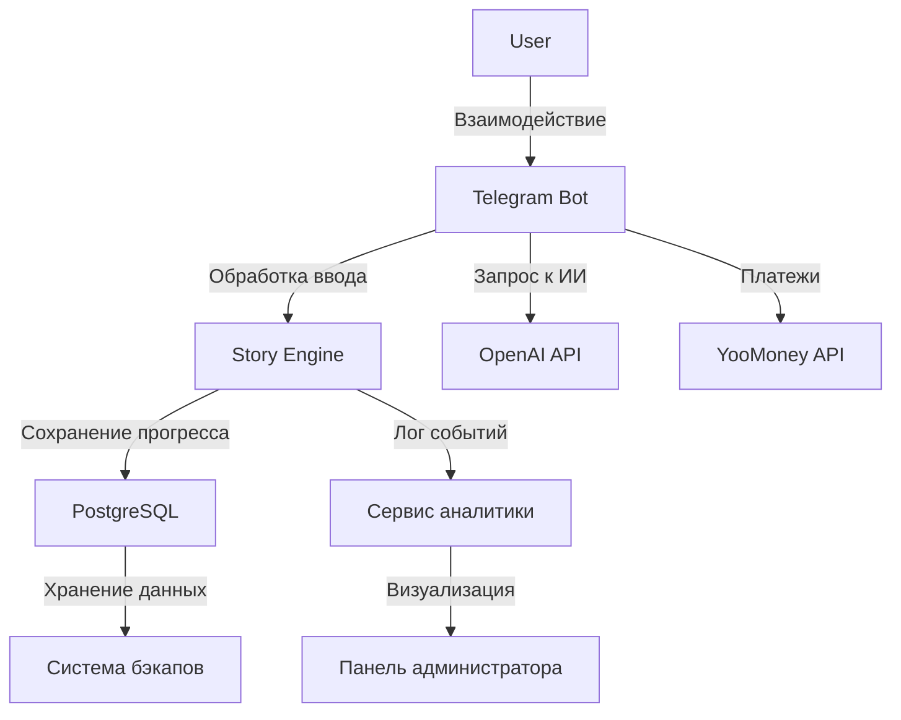

# Функциональные диаграммы

## 1. Обзор

Функциональные диаграммы показывают **архитектуру системы, логику взаимодействия бота, структуру базы данных и точки API** для Sherlock AI. Они помогают понять, как модули взаимодействуют друг с другом, и упрощают разработку и отладку.

* * *

## 2. Диаграмма архитектуры системы

Ниже диаграмма, отображающая, **как взаимодействуют различные сервисы**: бот, база данных, внешние API и модули аналитики.

* * *