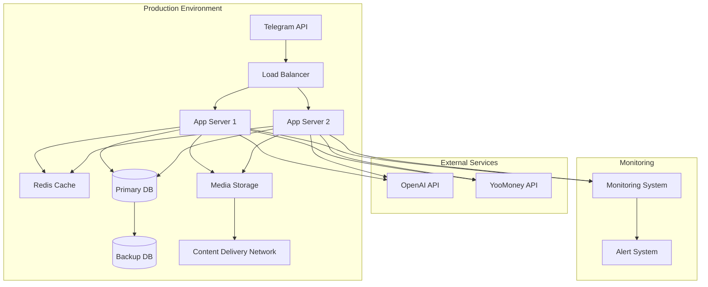

# API Документация

## Обзор

API Sherlock AI предоставляет конечные точки для управления сюжетами, взаимодействий с пользователями и административных операций.

## Аутентификация

Все запросы требуют JWT. Токены выдаются через эндпоинты `/auth`.

### Управление токенами

* Генерация и проверка через сервис TokenManager
* Автоматическая ротация токенов
* Для подробностей см. [Security Token Management](./security-token-management.md)

## Базовый URL

[https://api.sherlock-ai.com/v1](https://api.sherlock-ai.com/v1)

## Эндпоинты

### Аутентификация

```
POST /auth/login
POST /auth/refresh
POST /auth/logout
```

### Управление сюжетами

```http
GET /stories
GET /stories/{id}
POST /stories/progress
PUT /stories/{id}/state
```

### Управление пользователями

```http
GET /users/{id}
POST /users
PUT /users/{id}
DELETE /users/{id}
```

### Интеграция платежей

```http
POST /payments/create
GET /payments/{id}
POST /payments/webhook
```

## Ошибки

| Код | Описание |
| --- | --- |
| 401 | Несанкционированный доступ |
| 403 | Запрещено |
| 404 | Не найдено |
| 429 | Превышен лимит запросов |
| 500 | Внутренняя ошибка сервера |

* * *

# deployment-architecture.mermaid

