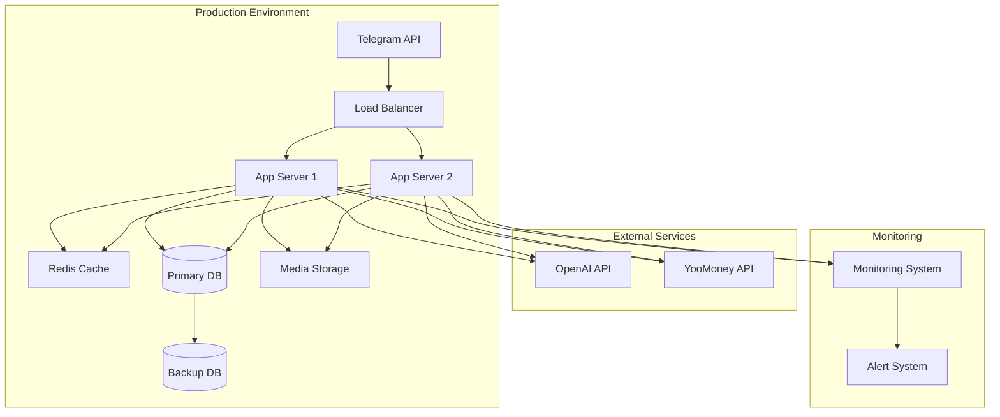

# Руководство по развертыванию

## Настройка окружения

### Предварительные требования

* Python 3.9+
* PostgreSQL 13+
* Redis 6+
* Docker & Docker Compose

### Конфигурация

```bash
# Необходимые переменные окружения
TELEGRAM_BOT_TOKEN=
OPENAI_API_KEY=
YOOMONEY_API_KEY=
DATABASE_URL=
REDIS_URL=
```

### Локальная разработка

1. Клонировать репозиторий
2. Создать виртуальное окружение
3. Установить зависимости
4. Настроить переменные окружения
5. Запустить миграции базы данных
6. Запустить локальный сервер

### Продакшен-развертывание

1. Сборка Docker-образов
2. Настройка балансировщика нагрузки
3. Подключение мониторинга
4. Запуск через Docker Compose
5. Проверка работоспособности

## Мониторинг

* Prometheus `/metrics`
* Grafana дашборды
* Sentry для ошибок
* ELK для логов

* * *

## Диаграмма

