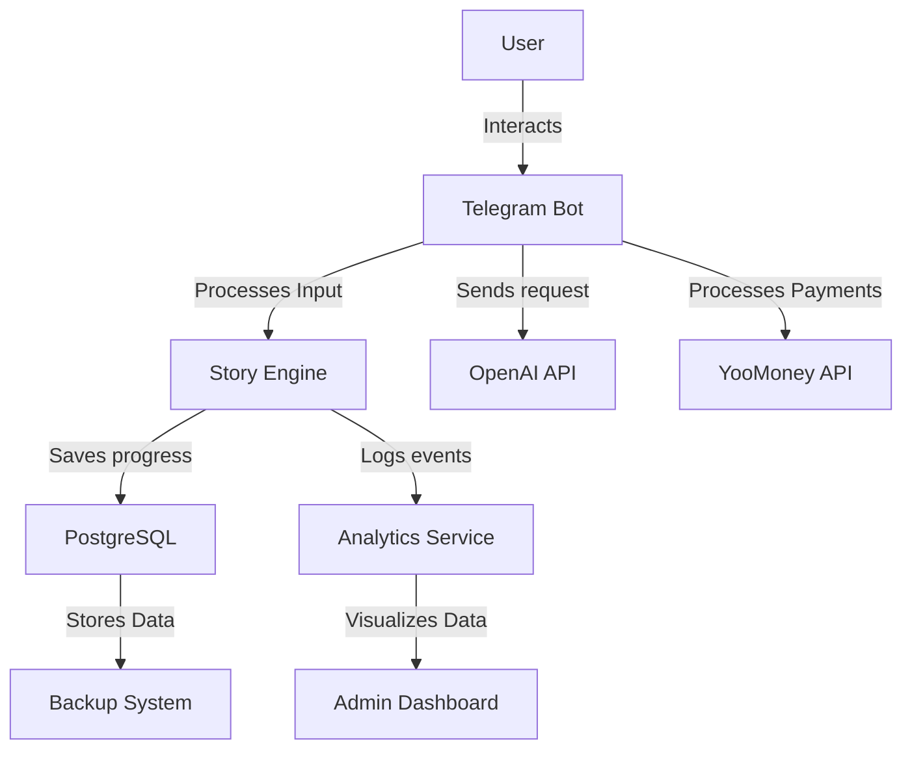
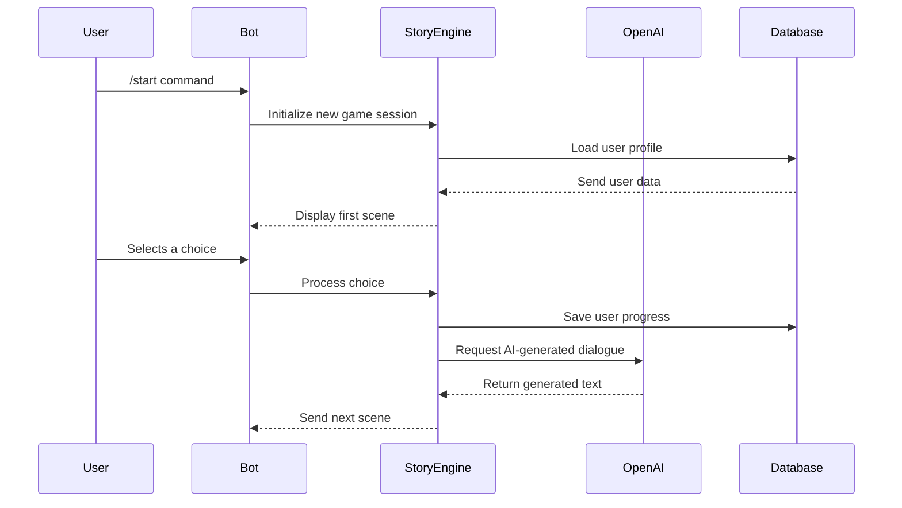
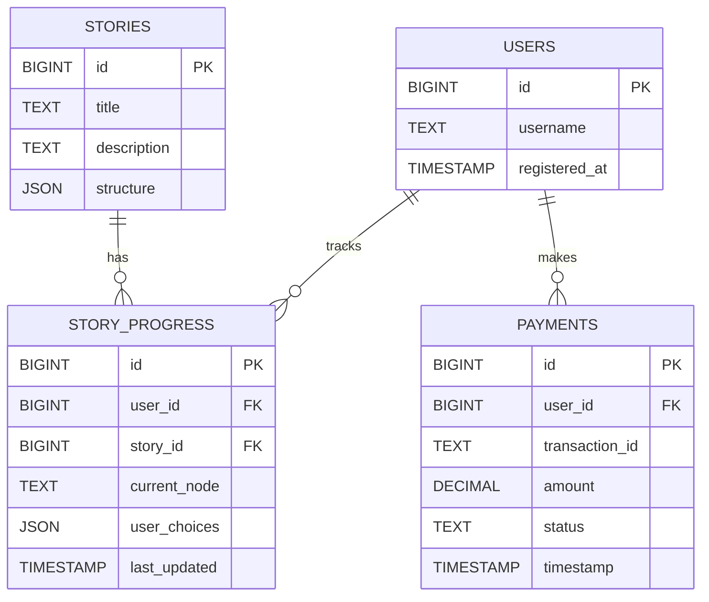
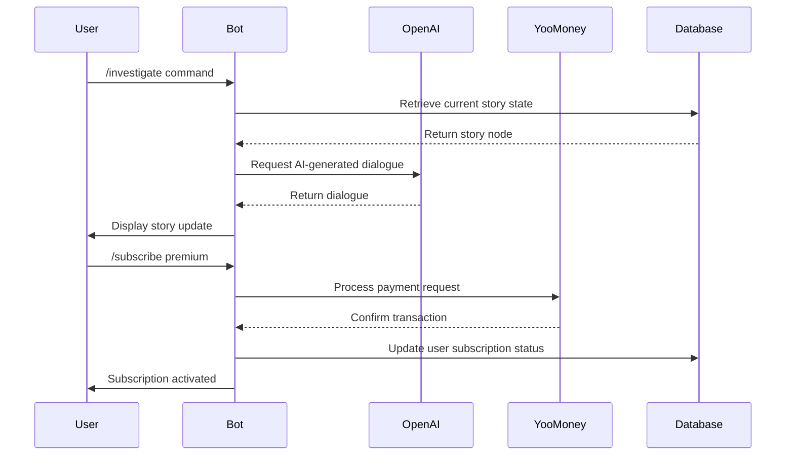
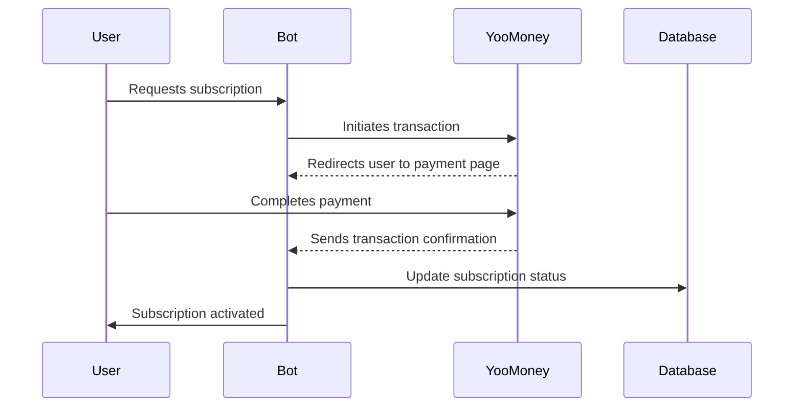
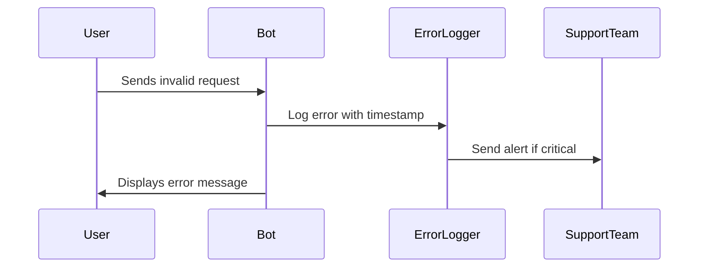

# Functional Diagrams

## 1. Overview

Functional diagrams illustrate the **system architecture, bot interaction flow, database structure, and API integrations** for Sherlock AI. These diagrams provide a **clear visualization of how different components interact**, ensuring smooth development and troubleshooting.

---

## 2. System Architecture Diagram

The system architecture diagram outlines how **different services interact**, including the bot, database, external APIs, and analytics.

------

## 3. User Interaction Flow

This sequence diagram details a **typical user interaction with the bot**, from starting a story to making choices.

------

## 4. Database Structure Diagram

This ER diagram shows how Sherlock AI **stores and manages data**, including user progress, story structure, and payment records.

------

## 5. API Interaction Flow

This diagram shows how the **Telegram Bot** interacts with external APIs.

------

## 6. Payment Processing Flow

This diagram explains how **payments are handled securely** via YooMoney.

------

## 7. Error Handling Flow

This diagram illustrates how **errors are logged and handled** in Sherlock AI.

------

## 8. Priority and Next Steps

### 8.1 Priority Level: **High**

Diagrams are essential for **developers and stakeholders** to understand system interactions. These must be included **before the specification is finalized**.

### 8.2 Next Steps

1. **Refine database schema based on latest changes.**
2. **Validate API interaction workflows.**
3. **Ensure payment flow is fully documented.**
4. **Review all diagrams for accuracy and completeness.**
5. **Integrate diagrams into the final specification document.**

------

## 9. Dependencies

- **Backend Engineers**: Verify database relationships.
- **Frontend Developers**: Validate user flow consistency.
- **DevOps Team**: Confirm API integration workflows.
- **Product Manager**: Approve overall system structure.
