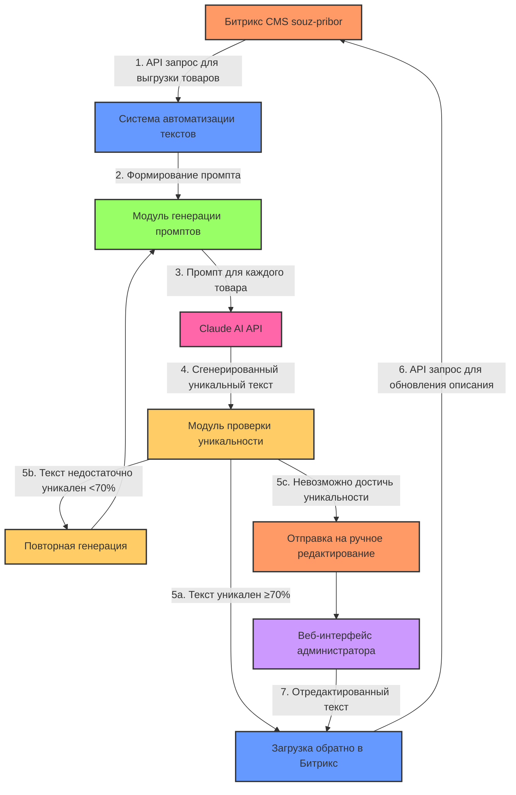
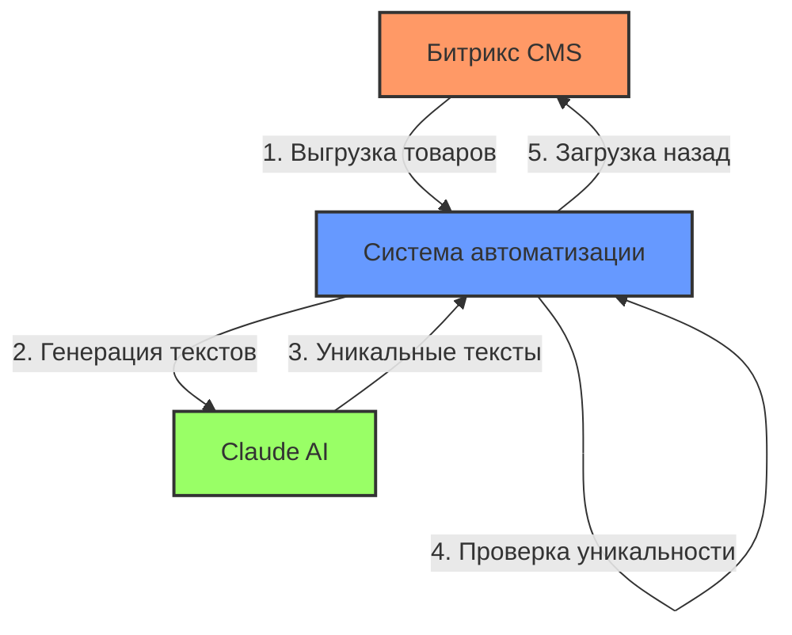
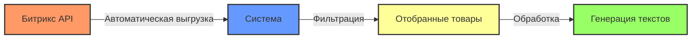
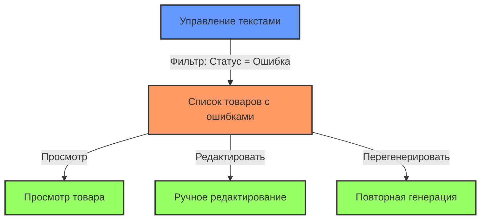
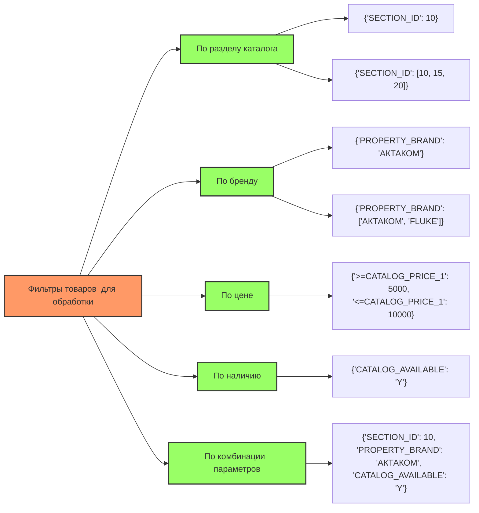
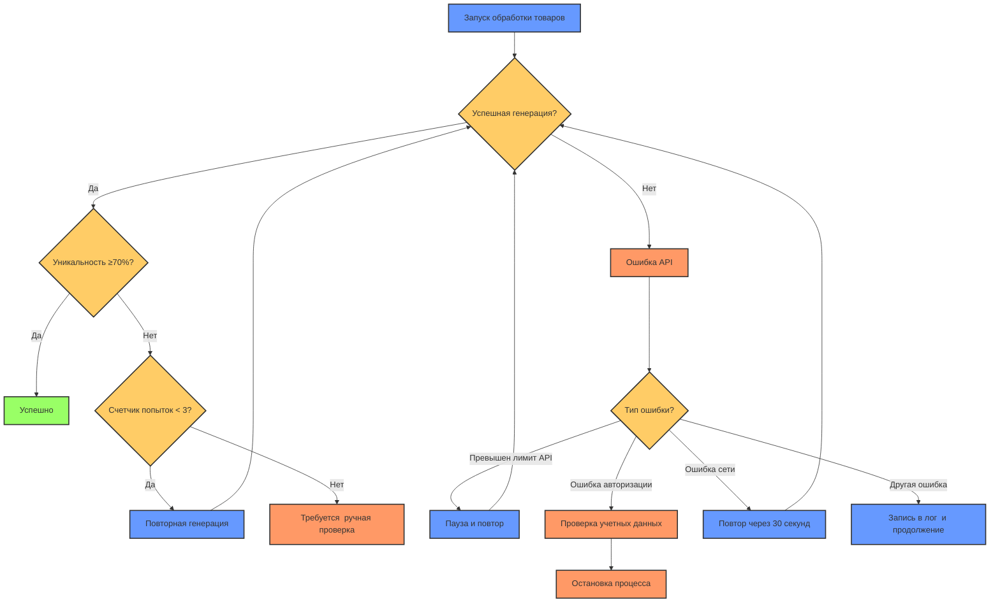

# Руководство по использованию системы автоматизации текстов

## Содержание
- [Общий принцип работы системы](#общий-принцип-работы-системы)
- [Источники товаров](#источники-товаров)
- [Запуск обработки товаров](#запуск-обработки-товаров)
- [Тестирование на одном товаре](#тестирование-на-одном-товаре)
- [Просмотр результатов и управление ошибками](#просмотр-результатов-и-управление-ошибками)
- [Настройка промптов](#настройка-промптов)
- [Часто задаваемые вопросы](#часто-задаваемые-вопросы)

## Схема работы системы автоматизации текстов




## Общий принцип работы системы

Система работает по следующему алгоритму:



## Источники товаров

### Как система получает товары

Система взаимодействует напрямую с вашим Битрикс через API. Вам не нужно вручную загружать или выгружать файлы CSV - система делает это автоматически.



На этапе отладки можно загрузить CSV вручную; после подписания акта система переключается на прямой обмен по API

### Где найти ID товаров для тестирования

Вы можете получить ID товаров несколькими способами:

1. **Из админки Битрикс**: Откройте товар в админке Битрикс, ID будет отображаться в URL или в информации о товаре
2. **Через отчет системы**: Во вкладке "Статистика" системы есть общий список обработанных товаров
3. **Выполнив тестовую выгрузку**: Нажмите "Экспорт" в меню системы с небольшим лимитом (10-20 товаров)

## Запуск обработки товаров

### Настройка параметров обработки

1. **Количество товаров**: Укажите максимальное количество товаров для обработки (например, 100)

2. **Фильтр (JSON)**: Позволяет отбирать товары по определенным критериям:
   ```json
   {"SECTION_ID": 10}
   ```
   Это обработает только товары из раздела с ID=10

3. **Параметры проверки**:
   - ✅ **Проверять уникальность**: Включает проверку на уникальность текста
   - ✅ **Пропускать уже обработанные товары**: Пропускает товары с уже имеющимися уникальными описаниями
   - ✅ **Автоматический повтор при ошибках**: Автоматически перезапускает генерацию при ошибках

   **Параметр «Количество товаров»**  – ограничивает верхний предел выборки, когда фильтр очень широкий или пустой. Если оставить поле пустым, система обработает все товары, попавшие под фильтр

   ## **Массовая обработка без ID**  

   для пакетного запуска достаточно задать фильтр (или оставить его пустым) и нажать «Запустить»; вводить ID не нужно.

### Запуск процесса

После настройки параметров нажмите кнопку "Запустить обработку". Система начнет автоматическую выгрузку товаров из Битрикс согласно указанным параметрам фильтрации.

**Важно:** Первая обработка может занять больше времени, так как система настраивается под ваши товары.

## Тестирование на одном товаре

Перед массовой обработкой рекомендуем протестировать систему на конкретном товаре:

1. Введите ID товара в поле "ID товара" на вкладке "Тестирование"
2. Настройте параметры генерации:
   - **Температура**: Влияет на креативность текста (выше = более творческий, ниже = более консервативный)
   - **Максимальная длина**: Максимальное количество токенов в генерируемом ответе
3. Нажмите "Протестировать"

**Где взять ID для тестирования:** Вы можете использовать любой ID товара из вашего каталога. Найдите его в админке Битрикс или в выгрузке товаров. Вместо числового ID можно вставить прямую ссылку на карточку товара — система сама извлечёт ID из URL

## Просмотр результатов и управление ошибками

### Общая статистика

На главной странице отображается общая статистика:
- **Общее количество обработанных товаров**
- **Успешно обработано** (зеленый индикатор)
- **Ошибки** (красный индикатор)
- **Средняя уникальность** (синий индикатор)

### Просмотр товаров с ошибками

Для просмотра товаров с ошибками:

1. Перейдите на вкладку "Управление текстами" в левом меню
2. Используйте фильтр "Статус" и выберите "Ошибка" или "Требует проверки"
3. Нажмите "Применить фильтр"

Вы увидите список всех товаров с ошибками, которыми можно управлять:
- Просмотреть текст и причину ошибки
- Выполнить повторную генерацию текста
- Отредактировать текст вручную



### Кнопка "Приостановить"

Кнопка "Приостановить" становится активной только когда запущен процесс обработки. Если процесс еще не запущен или уже завершен, кнопка будет неактивна.


## Примеры фильтров для отбора товаров







## Настройка промптов

### Где найти редактор промптов

В текущей версии редактор промптов находится в расширенных настройках:

1. Перейдите в раздел "Настройки" в левом меню
2. Прокрутите страницу вниз до раздела "Параметры генерации"
3. Нажмите кнопку "Расширенные настройки"
4. Откроется редактор промптов, где можно настроить шаблон для генерации текстов

**Важно**: Изменение промпта влияет на все последующие генерации. Рекомендуем сохранить копию исходного промпта перед внесением изменений.

### Рекомендации по настройке промптов

Эффективный промпт должен содержать:
- Указание на сохранение всех технических характеристик
- Требование уникальности (не менее 70%)
- Инструкции по структуре текста
- Примеры желаемого формата

Пример фрагмента промпта:
```
Перепиши описание товара, сделав его уникальным (не менее 70% уникальности).
Обязательно сохрани ВСЕ технические характеристики и их значения.
Структурируй текст для удобочитаемости (используй подзаголовки, маркированные списки).
Добавь 1-2 преимущества использования товара, которые логически следуют из его характеристик.
```

## Часто задаваемые вопросы

### Как долго длится обработка товаров?

Время обработки зависит от количества товаров и нагрузки на сервис Claude. В среднем система обрабатывает около 500-700 товаров в день при стандартных настройках.

### Почему некоторые товары отмечены как "Требует проверки"?

Это происходит, когда:
- Текст не достиг минимального порога уникальности (70%)
- В тексте обнаружены несоответствия с техническими характеристиками
- Произошла ошибка API, но текст был получен

### Могу ли я настроить фильтры для выбора конкретных товаров?

Да, вы можете использовать JSON-фильтры для выбора товаров по различным критериям:
- По разделу: `{"SECTION_ID": 15}`
- По бренду: `{"PROPERTY_BRAND": "АКТАКОМ"}`
- По нескольким критериям: `{"SECTION_ID": 15, "PROPERTY_BRAND": "АКТАКОМ"}`
