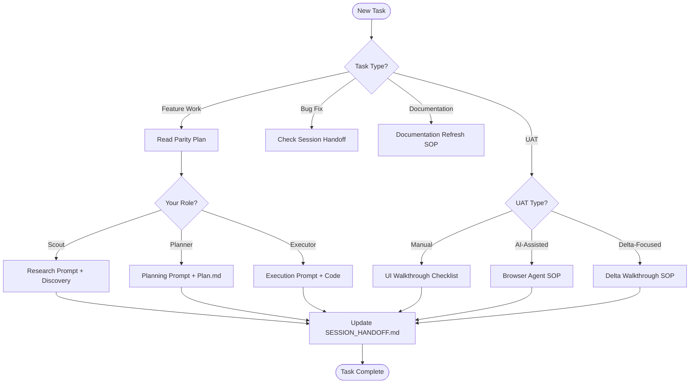

# START HERE – Roles, Flows, and Quick Links

> Governance: Do NOT create new top‑level folders under `docs/` without explicit owner approval. See `docs/SOP/directory-governance.md`.

Purpose
- Single entry point for agents. Pick your role and follow the links. Use the decision tree to route ad‑hoc tasks.

Decision Tree (Mermaid)

Quick Links by Role
- Scout
  - Read: `docs/SOP/code-change-plan-sop.md` (Exploration)
  - Output: discovery notes + links with file:line citations
- Planner
  - Read: `docs/SOP/code-change-plan-sop.md` (Planning)
  - Output: `plans/YYYY-MM-DD_<task>.plan.md` with tests/rollback
- Executor
  - Read: `docs/SOP/plan-execution-sop.md`
  - Output: code changes + tests + deployment URL
- UAT
  - Index: `docs/SOP/uat/master-uat-workflow.md`
  - Delta focus: `docs/SOP/uat-delta-walkthrough-sop.md`
  - Manual walkthrough: `docs/SOP/ui-walkthrough-checklist.md`
  - AI‑assisted: `docs/SOP/ai-uat-browser-agent.md`

Operational Links
- Status dashboard: `docs/STATUS_DASHBOARD.md`
- Handoff log: `docs/SESSION_HANDOFF.md`
- Parity roadmap: `docs/System/parity-roadmap.md`
- Reports index: `docs/System/DEMO_PARITY_INDEX.md`
