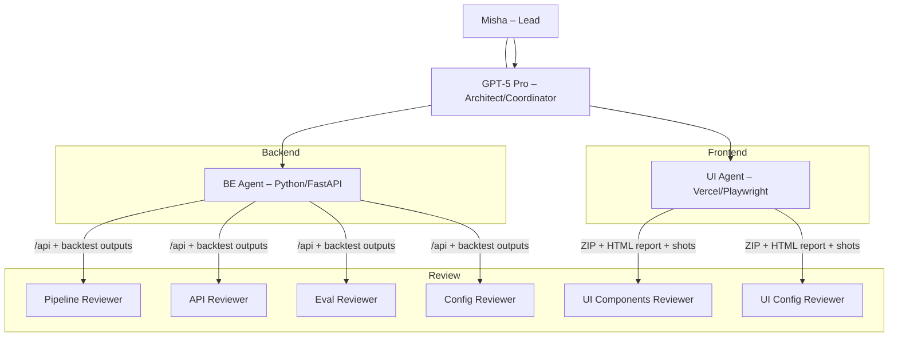

Short answer: **yes—ship the BE bundles to reviewers now.** The docs‑agent’s plan is solid and aligned with the orchestrator’s guidance. Below I give (1) a crisp GO/NO‑GO, (2) a focused BE accuracy loop to settle **site‑level WAPE** tonight, (3) exact UI tasks to run in parallel, and (4) what to put in each reviewer’s packet. I cite your attached evidence where relevant.

------

## 1) GO/NO‑GO to share with reviewers

**GO** — the trimmed coordinator drop already contains everything reviewers need and the “quick verify” commands. It points to both live URLs, the exact demo date, and four cURLs to validate the API envelope before review. Acceptance bullets match what the master review asked (CORS lock, CSV via DictWriter, rate‑limit, demo date, non‑empty routes, HTML report/screenshots). 

Your **OpenAPI** file advertises the exact read‑only endpoints we’re asking reviewers to exercise (`/api/metrics`, `/api/districts`, `/api/sites`, `/api/site/{site_id}/trajectory`, `/api/routes`) with typed response models (e.g., `RouteRow`, `SiteRow`, `MetricsEnvelope`). That makes contract checking straightforward. 

Backtest **histogram gallery** + links to `scoreboard_consolidated.csv` and `SUMMARY.md` are in place for evaluation reviewers. Include this link alongside the bundles so they can eyeball distribution shape when they report WAPE. 

Finally, **smoke evidence exists** (Behave @smoke: 8 passed, 25 skipped), which is enough for reviewers to trust the snapshot (they don’t need full trace). Include the log tail. 

> **Verdict:** Safe to distribute the 6 bundles now **and** start the site‑accuracy loop in parallel.

------

## 2) BE focus loop — produce credible **site‑level WAPE** tonight

Goal: either **(A)** produce Overall & Median site‑WAPE with scoreboards for a clear window we can show tomorrow, **or (B)** decide to present district‑only and document why.

**Window & inputs (adjustable)**

- **Train‑until:** `2024‑07‑31`
- **Daily window:** `2024‑08‑01:2024‑08‑07` (we can widen once data confirms overlap)
- **Inputs:**
  - `data/sites/sites_registry.csv`
  - `data/sites/sites_service.csv` (actuals)
  - **Forecasts CSV** (for the same window): `reports/sites_demo/daily_fill_2024-08-01_to_2024-08-07.csv`

**Command (ready to paste)**

```bash
python scripts/backtest_sites.py \
  --train-until 2024-07-31 \
  --daily-window 2024-08-01:2024-08-07 \
  --monthly-window 2024-08:2024-08 \
  --sites-registry data/sites/sites_registry.csv \
  --sites-service data/sites/sites_service.csv \
  --outdir reports/site_backtest_candidate \
  --use-existing-sites-csv reports/sites_demo/daily_fill_2024-08-01_to_2024-08-07.csv
```

**What to check immediately (in the outdir):**

- `SUMMARY.md` contains **Overall site‑level WAPE** and **Median per‑site WAPE** (these are the two numbers we’ll show).
- `scoreboard_site_daily.csv` and `scoreboard_site_monthly.csv` are **not empty**.
   (Your consolidated histograms page already links to `SUMMARY.md` and the global scoreboard; keep using those for reviewer context.) 

**If numbers are credible (<= the thresholds you’re comfortable showing):**

- Copy `SUMMARY.md` + site scoreboards into `reviews/COORDINATOR_DROP/backend/` and add one line to `reviews/NOTES/eval.md` with the two key WAPE numbers and the show/hide decision for **Sites** tomorrow.

**Refresh acceptance proof:**

- Re‑run the **four cURLs** from the coordinator drop and paste results into `reviews/NOTES/api.md`. 

**Why this is aligned with ORCH:** the master review’s P0/P1 fixes (CORS lock, DictWriter CSV, rate‑limit, demo date) are already codified; tonight’s loop answers the orchestrator’s open question—**do we highlight Sites or keep Districts only**—with real, per‑site accuracy. (The master review itself called out these security/contract items and CSV handling, which you’ve already addressed.) 

------

## 3) UI work in parallel (demo‑safe; no API changes)

Use your **POST_DEMO_SINGLE_TASK** list but treat items 2–3 as **now**, because they de‑risk the live table today and don’t alter contracts:

1. **CSV feedback semantics (a11y)** – `aria-live="polite"` + `role="status"` in `RoutesTable`, `aria-busy` on the CSV button.
2. **Data‑fetch cohesion** – on date change, pass `sites` from parent (or a single hook) so routes & sites don’t desync for a moment.
    (These two are already captured in your single-task doc; run unit + PR E2E after.) 

**De‑prioritize for this demo:** i18n, keyboard nav, skeletons, retry helper, pagination—unless you have spare cycles after (1)–(2). The doc already lists them as TODO with acceptance criteria; keep them parked. 

------

## 4) What to hand reviewers (one screen each)

Include in your coordinator message **exactly**:

- **Live URLs & demo date:**
  - UI: `https://mytko-forecast-ui.vercel.app`
  - API: tunnel base (current Cloudflare URL)
  - Demo date: `2024‑08‑03`
  - **Quick verify** commands (4 cURLs). 
- **API contract:** attach `openapi.json` or link to `/openapi.json` so they can check models (`RouteRow`, `SiteRow`, `MetricsEnvelope`). 
- **Backtest context:** link to **Backtest Consolidated — Histograms** (`histograms_index.html`) + `SUMMARY.md` / `scoreboard_consolidated.csv`. 
- **Evidence of green smokes:** include the tail of **behave_smoke.log** (shows `8 passed, 25 skipped`). 

That’s everything a fresh reviewer needs to load and decide quickly.

------

## 5) Alignment with the orchestrator (and your earlier “stop” note)

- You already **accepted** the master review P0/P1 fixes; I’m not re‑debating them. We keep the 500/600 size rule with waivers, and we keep the test pyramid (unit/integration ✚ Behave ✚ PR E2E). (This matches your acceptance and the master review language on CORS/CSV/rate‑limit.) 
- Tonight’s **only strategic decision** is whether **Sites** accuracy is good enough to show. If yes, add the Sites moment to the demo; if no, keep the district view as the accuracy story and state why.

------

## 6) Who does what (now)

**BE (Executor — 45–90 min loop):**

- Run the **backtest command** above.
- If WAPE is credible, copy `SUMMARY.md` and both site scoreboards into the coordinator drop and log the two numbers in `reviews/NOTES/eval.md`.
- Re‑run the **four cURLs** and update `reviews/NOTES/api.md`. 

**UI (Executor — 45–90 min):**

- Implement **CSV a11y** + **data‑fetch cohesion**, run unit + PR E2E (prod alias), rebuild the ZIP with **HTML report + TIMINGS + 3 screenshots**.
- Keep the existing coordinator drop page and checklist inside the ZIP for reviewers.

**You (Coordinator):**

- Send the 6 bundles + links + “quick verify” to reviewers using the brief you drafted.
- Ask Reviewer C (Eval) to explicitly confirm **where** site‑level WAPE is computed and to quote the two numbers they see (Overall & Median).
- If BE numbers are good, ask UI to add a nightly‑only assertion on the “Overall site WAPE” tile text (optional, last mile).

------

## 7) Minimal mermaid to keep everyone synchronized



------

## 8) Tiny doc nits (optional but helpful)

- In the coordinator message, keep using the **“Quick Verify”** block exactly as in the drop readme to reduce mis‑runs. 
- When sharing the API contract, attach **your current `openapi.json`** (title “Forecast Read‑only API”) so reviewers don’t have to hit the tunnel during their read‑through. 
- In the UI handoff doc, keep items 2–3 (CSV a11y, data‑fetch cohesion) as **Now**, others as **Backlog**. 

------

### Bottom line

- **Docs‑agent approach**: ✅ Good. Minimal, additive, and matches ORCH intent.
- **Reviewer distribution**: ✅ GO — send the 6 bundles + links now. 
- **Critical path**: **Run the BE site‑WAPE loop now**; decide “show Sites vs. Districts only.”
- **UI**: Do CSV a11y + data‑fetch cohesion while BE runs; keep everything else optional.

If you want, I can paste ready‑to‑send one‑liners for BE/UI/Reviewers with exactly the commands and links from the coordinator drop so you don’t have to compose them again.