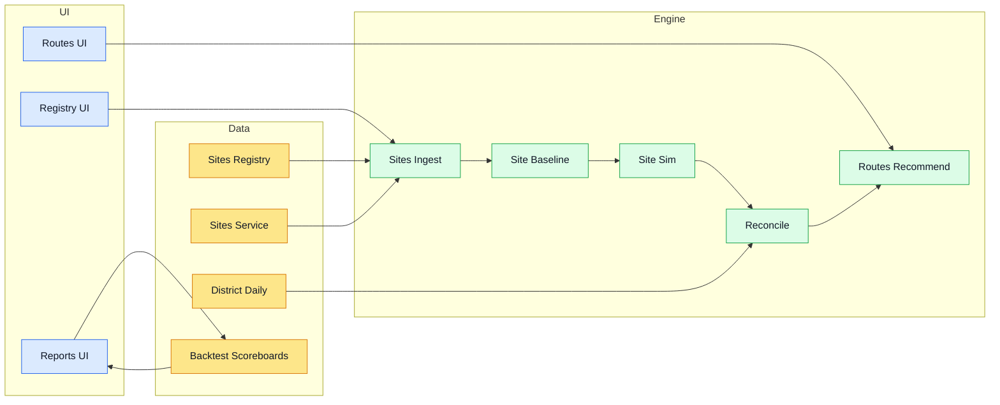

# Architecture: Forecast Integration

```mermaid
flowchart LR
  subgraph UI
    A[Routes UI]:::ui
    B[Registry UI]:::ui
    C[Reports UI]:::ui
  end

  subgraph Engine
    D[Sites Ingest]:::eng
    E[Site Baseline]:::eng
    F[Site Sim]:::eng
    G[Reconcile]:::eng
    H[Routes Recommend]:::eng
  end

  subgraph Data
    I[District Daily]:::data
    J[Sites Registry]:::data
    K[Sites Service]:::data
    L[Backtest Scoreboards]:::data
  end

  A --> H
  B --> D
  C --> L
  D --> E --> F --> G --> H
  I --> G
  J --> D
  K --> D
  L --> C

  classDef ui fill:#dbeafe,stroke:#2563eb,color:#111827;
  classDef eng fill:#dcfce7,stroke:#16a34a,color:#111827;
  classDef data fill:#fde68a,stroke:#d97706,color:#111827;
```

