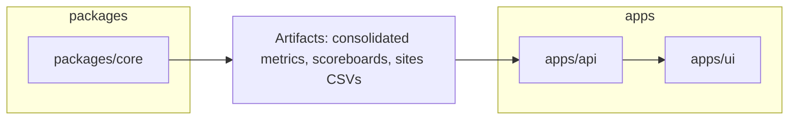

# Monorepo Plan (apps + packages)

Goal: house core forecasting, API, and UI together with clear boundaries, fast CI, and deployability.

## Layout
```
repo/
  packages/
    core/           # Python libs: forecasting logic, sites modules, backtests (pip install -e)
  apps/
    api/            # FastAPI (read-only initially), depends on packages/core
    ui/             # Next.js/Vercel app (already at /Users/m/git/clients/rtneo/ui)
  tools/            # CI scripts, linters, formatters
  .github/workflows/
```

## Responsibilities
- packages/core: pure Python (no web), publishes wheels (optional). Exposes CLI entry points for backtests.
- apps/api: lightweight FastAPI, reads artifacts from a configured storage (local or S3), exposes JSON/CSV endpoints.
- apps/ui: consumes API; built on Vercel; no server secrets.

## Dev Orchestration
- Turborepo or simple Make targets to wire: `core:lint,test,build` → `api:dev` → `ui:dev`.
- Cache: pip cache + node cache. Keep Python/Node independent caches.

## CI
- Jobs: `core-tests` (pytest + coverage), `spec-sync`, `docs-check`, `api-smoke` (optional), `ui-build` (Vercel preview).
- Enforce: no default forecast behavior changes unless scenario/golden bump.

## Environments
- Local API exposure for UI dev:
  - Preferred: Cloudflare Tunnel (no approval dialog) → `https://<name>.trycloudflare.com` → proxies localhost:8000.
  - Alternatives: ngrok (requires token), Localtunnel, GitHub Codespaces port.
- Vercel integration:
  - Point UI `.env.local` to the tunnel URL for `/api/*` while developing.
  - Later: deploy `apps/api` to a small service (Railway/Render/Fly) with a stable URL.

## Deploys
- UI: Vercel (existing). Configure environment variable `NEXT_PUBLIC_API_BASE`.
- API: start as read-only demo; later migrate to managed host with health checks and gzip.
- Core: not deployed; packaged for reuse and tests.

## Data flow


## Migration Steps
1) Create `packages/core` and move `src/` + CLI scripts; publish editable install.
2) Create `apps/api` (copy current `scripts/api_app.py` + ASGI runner); wire env path to artifacts.
3) Move `/Users/m/git/clients/rtneo/ui` to `apps/ui` (or keep external and set API base URL).
4) Add Turborepo (optional) or keep Makefile with task aliases.
5) Update CI to run per‑app/package jobs with caches.

## Acceptance
- `pnpm dev` or `make dev` starts API and UI; UI renders metrics and sites tables from API.
- CI stays green (≥85% coverage; spec_sync, docs_check).
- No default forecast outputs changed; sites remain behind flags.

